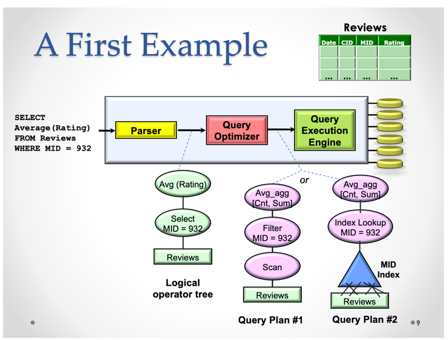
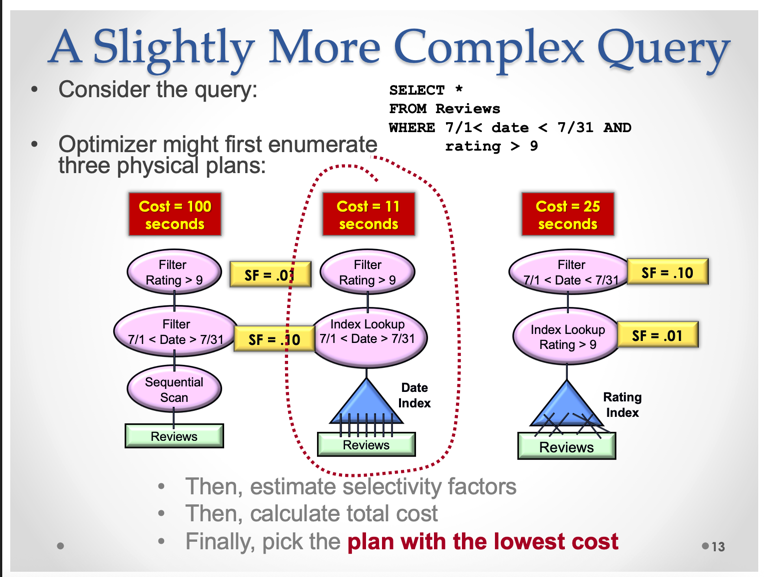
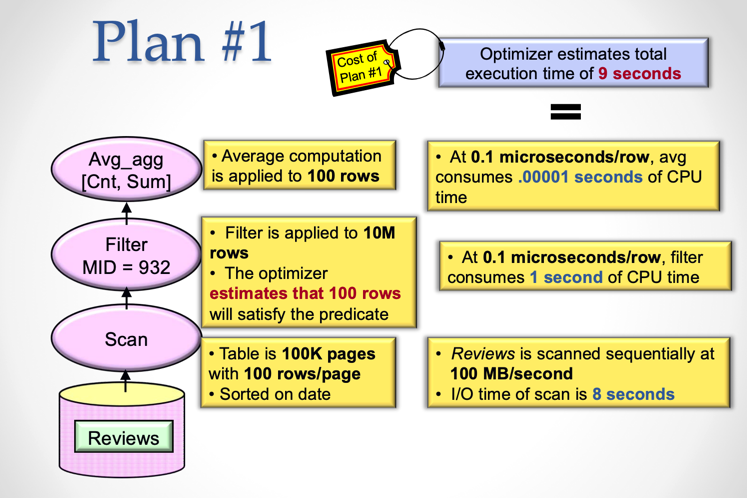
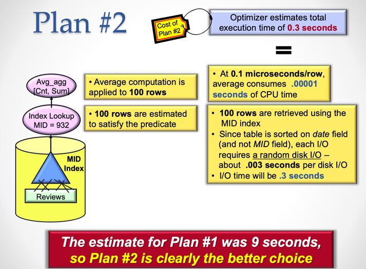
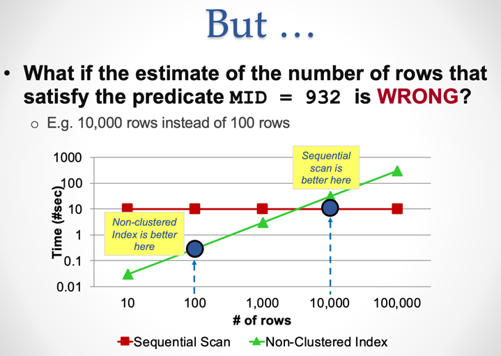

import MultipleChoice from '@site/src/components/MultipleChoice';
import CodeBlock from '@theme/CodeBlock';

# SQL Query Optimization

	<MultipleChoice
	  question={
	      <>
	        
With Pre-conditions below, which plan is more efficient for query in the image?

	        <ul>
						<li>1. Table Reviews have 100.000 pages with 100 rows/page, totals 10.000.000 records. Sorted on date</li>
						<li>2. Scan 100MB/second</li>
						<li>3. CPU time = 0.1 μs (10^-6s)/row for `FILTER predicate`</li>
						<li>4. CPU time = 0.1 μs (10^-6s)/row for `AVG predicate`</li>
						<li>5. Time Random disk I/O = 0.003 second per disk I/O</li>
						<li>6. 100 rows are estimated to satisfy the predicate</li>
					</ul>
	        <CodeBlock language="sql">
	        SELECT AVG(RATING) FROM Reviews WHERE MID = 932;
	        </CodeBlock>
	        
	      </>
	    }
	  options={[
	    "Plan #1",
	    "Plan #2",
	  ]}
	  correctIndex={1}
	  feedback={[
	    "Read this blog to know why Plan #2 is better",
	    "Correct! But plan #1 can be better WHEN  more than 10.000 rows that satisfy the predicate (100 rows is given in pre-condition 6)",
	  ]}
	/>

## What is QUERY OPTIMIZER ?

SQL statement -> **QUERY OPTIMIZER** -> Awesome plan

- QUERY OPTIMIZER transfer SQL queries into an efficient execution plan, one logical plan can have multiple physical plans.

### Logical plan
What they do, e.g: union, selection, join, project.

### Physical plan
How they do, e.g: nested loop join, merge join, hash join.

## Queries examples with plans

## How we know which plan is better
We need to ESTIMATE COSTS to choose plan. Two key costs that QO considers:
- I/O costs: reading page from storage
- CPU costs: applying predicate on tuples in memory

Now you can back to the [first question](#first-question) and try to calculate the cost of each plan.

	
Plan #1

	

	
Plan #2

	

	
Index is scattered over many pages

	

## Reference

[Download PDF](static/lec10.pdf)
