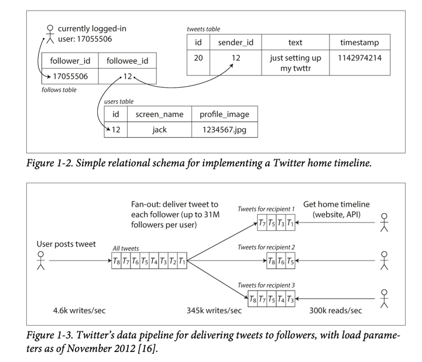
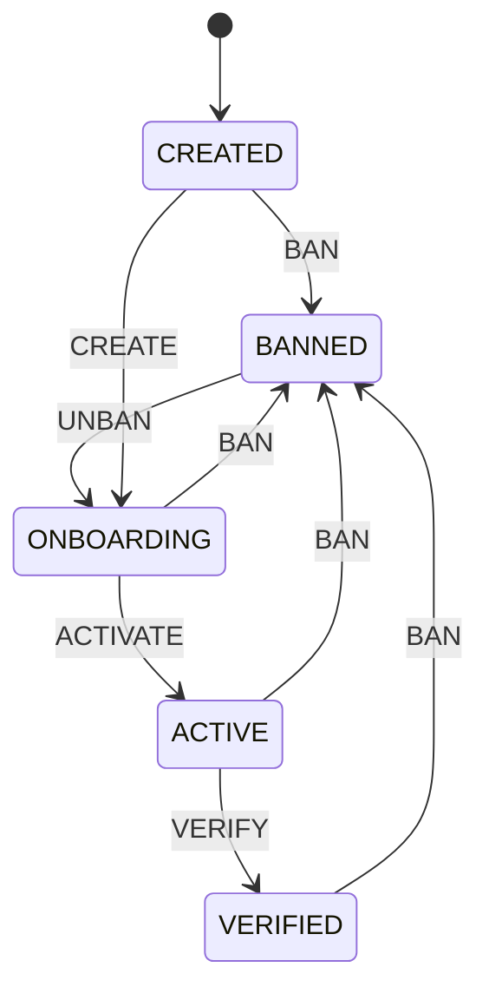

# Designing data intensive applications

## PART 1:

### Chapter 1: Reliable, Scalable, and Maintainable Applications

- Reliability
  - Hệ thống vẫn hoạt động tốt mặc dù có các lỗi sau xảy ra.
    - Tolerating hardware & software faults, human errors
- Scalability
  - Hệ thống có thể mở rộng để xử lý tải tăng (LOAD) mà không làm giảm hiệu suất (PERFORMANCE)
    - Measuring load & performance, latency, throughput
- Maintainability
  - Hệ thống dễ dàng thay đổi để thích ứng với sự thay đổi của yêu cầu. 
    - Operability (good metrics ), simplicity (good abstraction can help), evolvability (Agile, TDD)

#### Reliability -> ảnh hưởng tới revenue and reputation

- Hệ thống dự đoán được các lỗi (FAULT) xảy ra và xử lý được chúng, gọi là fault-tolerant or
  resilient.
    - Chắc chắn không phải là toàn bộ lỗi, ví dụ: có 1 hố đen nuốt chửng trái đất :))

- FAULT vs FAILURE:
    - fault: là khiến hệ thống hoạt động khác so với đặc tả (spec)
    - failure: là khi hệ thống ngừng hoạt động.

- Netflix chaos monkey: tạo ra các fault (bằng cách tắt 1 vài service) để kiểm tra hệ thống có 
 resilient không.

##### hardware faults

- Lỗi phần cứng
    - Disk bị hỏng
    - Memory bị lỗi
    - CPU bị lỗi
    - Network bị lỗi
    - Power bị lỗi
- Với Disk, dùng cơ chế RAID.
- Với power, dùng máy nổ (backup power)
- Tốt nhất là dùng redundant hardware
- Nếu có plan nâng cấp hệ thống, dùng cơ chế rolling upgrade.

##### software faults

- Thường khó xảy ra, nhưng xảy ra thì có thể gây hiệu ứng kéo theo
- Cách xử lý: test cẩn thận, monitor, log, alert.

##### human errors
- Sandbox nên dùng real data.
- Unit test, integration test, manual test, automated test. -> khá oke.
- `Rollback đơn giản khi có lỗi user` -> công ty mình chưa làm được.
- `Set up detail and clear monitoring (metrics, error rates)` -> nên dành thời gian nghiên cứu.

#### Scalability
- Describe Load (RPS, ratio read/write db, concurrent users)
  - 1 bài toán hay của twitter về `LOAD`
    - Post tweet: 4.6k write rps
    - Home timeline: 300k read rps
  - Có 2 cách xử lý ở home timeline.
    - những những user có ít follower, khi post tweet, sẽ write vào home timeline của những follow đó. 
    - với những user có theo dõi celeb, query riêng những celeb này
  - 

- Describe Performance (what happen when load increase), hệ thống sẽ ảnh hưởng thế nào khi rps tăng, và resource phải tăng như thế nào để đáp ứng với điều đó.
  - Throughput, Latency (là trạng thái mà data latent, đang chờ dịch vụ), response time (là toàn bộ thời gian để process request)
    - response time là 1 distribution of values (chứ ko phải 1 giá trị cố định)
    - latency: context switch, loss of network package, GC pause.
  - Vì response time là 1 distribution, nên cần phải xem xét về `percentiles` (50th - median, 95th, 99th, 99.9th).
    - Vậy chúng ta có cần quan tâm 99.9th không. Tuỳ vào business, ví dụ amazon, khách hàng đó có nhiều data nhất, là người trả nhiều tiền nhất, nên cần phải quan tâm.
    - 99.99th thì không đáng. (1/10000), có thể vì nhiều lí do nằm ngoài tầm kiểm soát
  - `Queue thường là thứ gây ảnh hưởng ở các percentile cao. Ví dụ có 1 request nằm trong queue, ở vị trí đầu tiên xử lý chậm, nếu đo cho từng request ở server, chúng ta thầy hầu hết request đều xử lý nhanh, nhưng request chậm làm cho toàn bộ user nằm trong hàng đời đó thấy chậm, vậy nên chúng ta cần quan tâm tới client response time. Khi noí đến queue thì thường đã là luồng async, phải có cách để đo từ trước khi vào queue lẫn sau khi vào queue.`

- Distributed system is the future, because it's ez of use and maintainability.
  - type of problem: volume of read, volume of write, volume of data, the complexity of data, the access pattern,... make design of system different.
  - eg: 100.000 rps with 1KB size vs 3 rps with 2GB size.

#### Maintainability
- Operability
  - `review lại toàn bộ flow của công ty, xem nên monitor như thế nào, cách monitor hiện tại đã hiệu quả chưa` 
- Simplicity
  - One of best tool is abstraction.
    - eg: SQL is a good abstraction for disk and in-memory storage, high-level language is a good abstraction for machine code.
- Evolvability
  - Hệ thống có thể bị thay đổi vì nhiều lí do:
    - biz change, user yêu cầu tính năng mới, thay đổi platform, chính sách của nhà nước.

#### Summary
- Functional requirements:
  - cho phép data lưu trữ, lấy ra, tìm kiếm, ...
- Non-functional requirements:
  - reliability, scalability, maintainability, security, compatibility.

### Chapter 2: Data model and Query languages

### Chapter 3: Storage and Retrieval

- Index
  - heap read efficiency, but slow down write -> DB don't index by default -> heapfile + secondary index

- Index for kv data (data append only), some issue in real implementation.
  - Delete: append special delete records. when merge and compace -> ignore it.
  - Crash recovery: snap shot + append only file. 
  - Partially written records: use checksum
  - Concurrency control: 1 writer thread, read by multiple thread.

- cons: not support range query

- pros of append only
  - sequential write is better than random write.
  - eliminate the fragmentation.
  - crash recovery is simpler.

- The difference in random access performance between HDDs, SSDs, and RAM is due to:
  - Physical movement in HDDs (seek time and rotational delay).
  - Page and block limitations in SSDs, causing inefficiency in handling random accesses.
  - Direct access in RAM with no mechanical or block-based limitations.
- youtube: SSD vs Hard Drive vs Hybrid Drive

- hashmap use in memory better than in disk (use `Btree, LSM-trees` instead), the reason because
  - disk don't support random access
  - hard to update disk when resizing or rehashing.
  - solve collision by `chaning (linkedlist, tree)` or `open-addressing` is bad for disk. 

- SSTables (Sorted String Tables) -> NoSQL, eg: Google Bigtable, Apache Cassandra. 
  - sorted KV -> make merge ez (merge sort)
    - How? -> Btree, AVL tree, red-black tree (it in memory so call it `memtable`)
      - when `memtable` become GB, store on disk as an `SSTable file`.
    - is read good ?
      - first check in current `memtable`, then latest disk `SSTable`, then older disk `SSTable`.
        - if data is not exist -> it's slow query => `bloom filter`
    - Optimize
      - run merge and compaction at background (discard overwritten or deleted value)
    - Problem?
      - crash when `memtable` is not saved in disk -> keep log in disk (when `memtable` is saved in disk, remove corresponding log)
    - Inheritance: lucene, an indexing engine for full-text search used by Elasticsearch and Solr.
  - `sparse` in-mem index: no need index for all key (one key for every few KB) 
  
- LSM: merging and compacting sorted files on multiple SSTable.
  - merge in background
  - sequential write (on disk) => high write throughput (on RAM, random is not a problem)
    - need compact
  - break DB into segment (memtable)
- downside of LSM
  - if compaction is not configuration well -> can't not compaction -> many SStable -> read slow -> out of disk. -> need explicit monitor

- Btree
  - support range query, keep key-value in order too.
  - break DB into page (4KB) - design closely to disk page size
  - Crash recovery: need WAL (redo-log)
  - Random write (on disk), overwrite a page on disk with
    new data

- Btree optimization 
  - copy-on-write instead of WAL.
  - B+tree for chain leaf node

- Btree vs LSM
  - Btree for read (bad for write because need write page random on disk, write for WAL, if page is split, need write more page). DB still need to write an entire page if only a few byte in that page changed. If use HDD, random write is bad, SDD less suffer from random write. fragment, no compact -> larger disk usage. 
  - LSM for write (bad read because need check many place).
    - but write still effect by write amplification (need to write many time for 1 write -> 1 for disk, some for compaction, but LSM better than Btree. 
  - Nếu băng thông tối đa của đĩa là 100 MB/s, thì ghi 1 GB sẽ mất khoảng 10 giây. Nhưng với write amplification, ghi 3 GB sẽ mất đến 30 giây. Điều này làm giảm số lượng thao tác ghi mà hệ thống có thể xử lý trong một khoảng thời gian cố định, tạo ra nút thắt cổ chai cho hiệu suất.

- Other indexing structure
  - heapfile:
    - ko cần range query, data ko cần theo thứ tự.
    - index nhiều ở các chỉ mục phụ -> extra hop when move to real data -> divide `cluster index - store index with data` and `non-cluster index- store index with reference of data`.
    - write heavy (record append only)
  - multiple-column index
    - concatenated index -> order is the most important
    - multiple-dimension index -> Rtree.

- => because disk are slow than RAM, so we move to in-memory database like mem-cache or redis, we can keep data by
  - keep append-only log of changes in disk for durability
    - redis -> weak durability by write to disk asynchronously (need check again after many years)
    - RAMCloud is an open source, support nice durability
    - VoltDB,MemSQL, Oracle TimesTen support nice durability
  - period write snapshot to disk 
- Cons of in-memory database
  - in-memory database are difficult to implement with disk-base index
    - eg: Redis use priority queue and set, instead of page, that Btree use, or segment like LSM. (need check does LSM is good ?)

- in-mem vs disk base
  - in-mem has high performance not because that we read data from MEM instead of disk, because if MEM large enough, OS will cache data for DB.
  - the main reason is we `don't need to serialization` from disk to mem, or prepare specification data-structure that work on disk

- RAM(16GB) vs DISK(1TB) - SSD HDD (page 4096)
  - disk -> page
  - RAM -> random access -> 
    - 

- Note
  - anti-caching approach: evict the least recently use by save in disk when RAM is full, and load it back when need.(it like what OS do with virtual memory and swap page)

- Data warehouse (for OLAP)
  - row oriented storage
    - need load all record to mem before filter anything. => column-oriented storage 
  - column-oriented storage
    - store all the value of column together instead.
      - use schema star and snowflake
    - problem: 

### Chapter 4: Encoding and Evolution

### Chapter 5: Replication
- Replication is used for
  - Scalability: distribute load to multiple server
  - Fault tolerance: if one server is down, other server can take over.
  - Latency: put data near to user.
- 

### Chapter 6: Partitioning
- how many way to partitioning + index on it -> 3 ways
- how secondary-index work in partitioning -> document based and term based
- how re-balancing cluster -> 3 way, but not deep.
- how DB route request to correct partition.
  
- partitioning help distributed workload
  - problem come when 1 node is skewed (node have more data that others)

- Partitioning by key-value data
  - eg: node 1 (A-B), node2 (C-E) => data is un-uniform distributed.
    - admin need determine right
- `Partitioning by key range`
  - query by time range shouldn't be the first key in partitioning, because it's make data skewed.
    - we need another key (eg: sensor name) to be the first key.
- `Partitioning by hash key`
  - data is quite uniform distributed if hash is good -> but the sort advantage is lost. => range query is need visit all nodes.
    - cassandra achieve a compromise between 2 partitioning strategies. if the first primary key is fixed, the other columns can range query.
  - consistent hashing => ez to re-balancing
  - If data is hot (of celebrity)
    - add random number at the beginning of key (10), and when read, query all from 10 node above.

- partitioning with secondary-index
  - `document-based` and `term-based`
- `document-based`
  - aka `local-index`, need query all nodes => but it's still widely used, mongoDB, couchbase, elastic search, cassandra.
- `term-based`
  - aka `global index`, partition second-index too, make read more efficient => but writes are slower and complicated => async write => not common in real world.

- Re-balancing meet some minimum requirement.
  - after re-balancing, the load should be shared fairly
  - while re-balancing, db should continue serving.
  - no-more data than necessary should be moved.

- Strategies for re-balancing
  - `1. fixed number of partitions` (1000 partition for 10 node)
    - need to choose right `number of partition` -> too many partition -> rebalancing become expensive, too few partition -> overheads
    - riak, elastic search, couchbase, voldemort
  - `2. dynamic partitioning`
    - use for key-range partitioning (also work for hash-partition too), when a partition become hot, split it into 2 partition, and when it's cold (many keys are deleted), merge it back.
    - Hbase and mongoDB
  - `3. partition conresponding to node`
    - 2 way above make partitions independent with nodes.
    - cassandra use this way

- how DB route request to correct partition
  - service discovery (in all case, how component making the routing decision). figure 6.7
    - allow client to contact any nodes (via round-robin load balancer)
      - cassandra with gossip protocol
    - client send request to routing tier first.
      - kafka, mongo
    - require client know about partitioning -> route direct to appropriate node

### chapter 7: Transactions
- why we need transaction (some things go wrong)
  - what transaction does for safety guarantees, what cost are associate with them.

- Atomicity is something that can't be broken down into smaller part.
  - eg: if a transaction is doing a atomic operation, other transactions can't see the partial state of system, just before or after it.

## Note để tối ưu cho hệ thống của mình
- Đọc lại bài toán của twitter.
- Xem lại queue, cần đo lường từ trước khi vào queue, lẫn sau khi vào queue.

