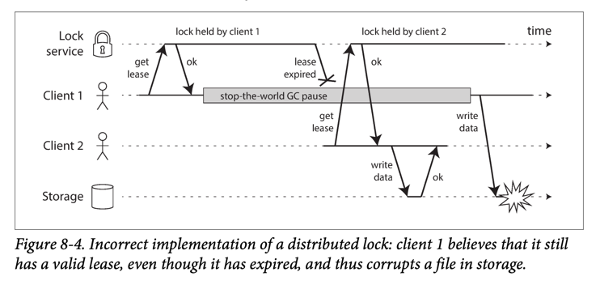

# Problems at Redis in microservices

## Cache avalanche
- At a certain moment, all caches expire at the same time or redis fails, causing a large number of requests to database. Database is likely to suspended. If DBA restart the DB, It still can't handle the large number of requests. This is called cache avalanche.
- Solution: 
  - Use cache with different expiration time.
  
# Cache breakdown
- Cache breakdown is a situation where a cache key is invalidated and a large number of requests are sent to the database to retrieve the data. This is a situation where the cache is not used.
- Solution:
  - Don't set expire time for hotspot key. 

# Cache penetration
- Cache penetration is a situation where a cache key is not found in the cache and a large number of requests are sent to the database to retrieve the data (and don't have in database too).
- Solution:
  - Write code to handle exceptional case (eg: return null immediately if the key is not valid). 
  - Use bloom filter to check if the key is in the cache or not.
    - eg: request -> `[bloom filter]` -> `[cache]` -> `[database]` -> response

## Implement wrong lock
