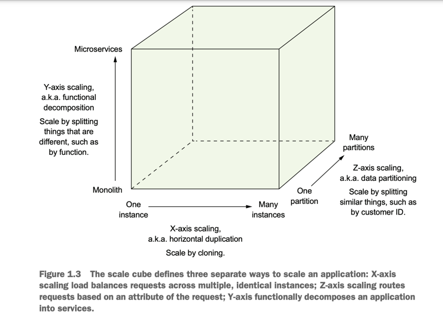
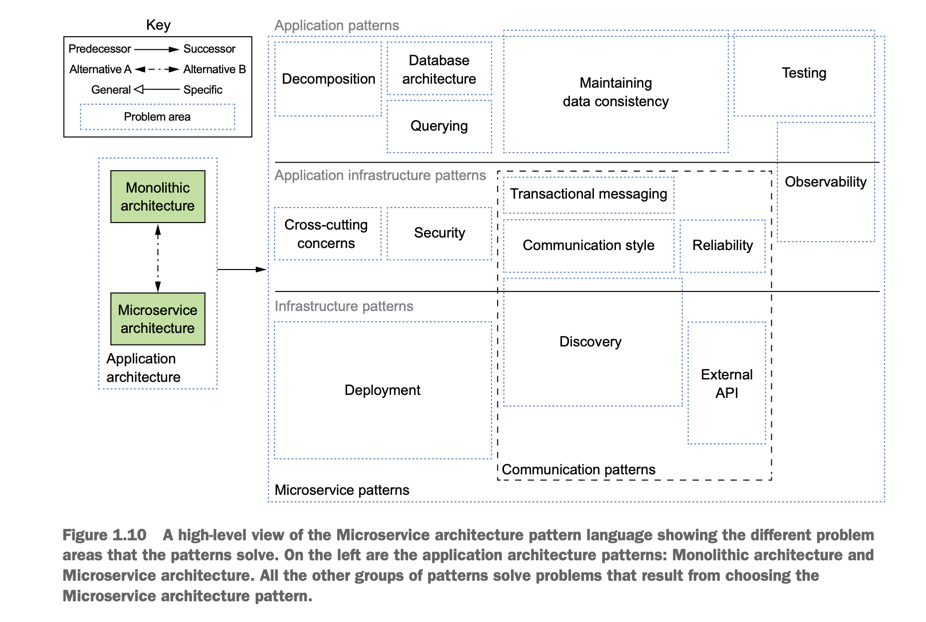
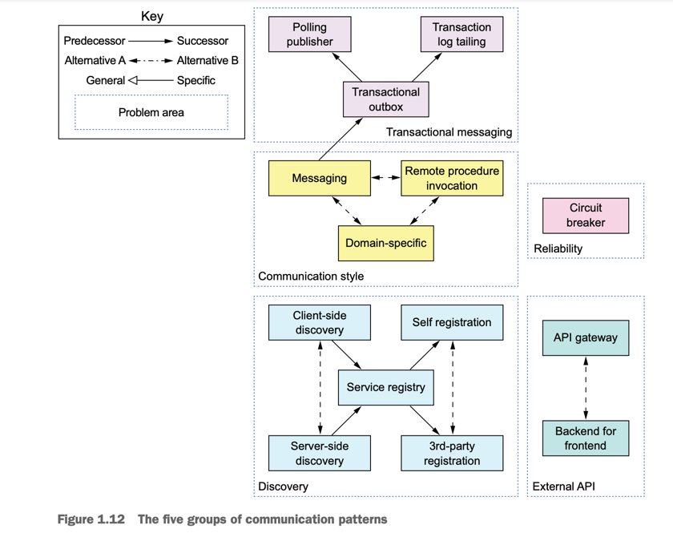
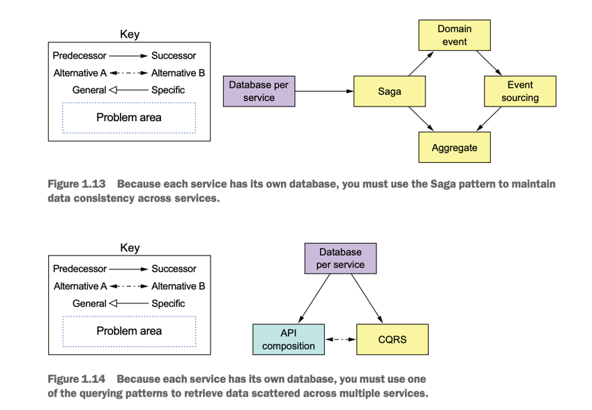
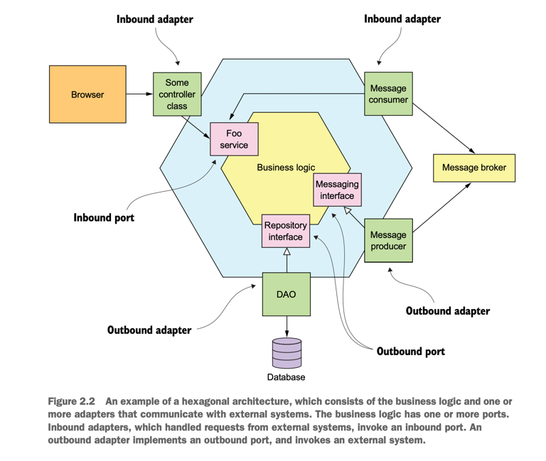

# Microservice Pattern with example in Java part 1

_To see the future, you must know the past_

This page talks about lessons learned from the book <span className="layered-style">"Microservice Patterns with example in Java"</span> by Chris Richardson, so sentences are my own thoughts, not from the book.
<!--   style="color: #FF6F61;" -->

## Chapter 1: Escaping monolithic hell

<span className="layered-style">I see a nice picture about three-dimensional scalability.</span>


<details>
  <summary>Try to think 30s, how many type of scalability did you know in system design ?</summary>



1. X-Scale by cloning services
2. Y-From monolithic to microservices
3. Z-Scale by partitioning database
</details>

We will focus on Y-axis scaling, we will decompose the complex application into a set of services (_module_).
  - In the pov of developers: they can work independently.
  - In the pov of services: each service should have its own database.
    - Because if you can use an old database. I don't think it's a good idea to split the service.

### Pattern language
- A high-level view of the Microservice architecture pattern language


<span className="layered-style">PATTERNS FOR DECOMPOSING AN APPLICATION INTO SERVICES</span>

- **Decompose by business capability**:
- **Decompose by subdomain**: organizes services around domain driven design (DDD) subdomains.

<span className="layered-style">COMMUNICATION PATTERNS</span>

- Communication style—What kind of IPC mechanism should you use?
- Discovery—How does a client of a service determine the IP address of a service
  instance so that, for example, it makes an HTTP request?
- Reliability—How can you ensure that communication between services is reliable even though services can be unavailable?
- Transactional messaging—How should you integrate the sending of messages and
  publishing of events with database transactions that update business data?
- External API—How do clients of your application communicate with the services?



<span className="layered-style">DATA CONSISTENCY PATTERNS FOR IMPLEMENTING TRANSACTION MANAGEMENT</span>
- Distributed transactions (2PC) isn’t a viable option for a modern application. Instead, an application needs to
maintain data consistency by using the Saga pattern. Figure 1.13 shows data-related

<span className="layered-style">PATTERNS FOR QUERYING DATA IN A MICROSERVICE ARCHITECTURE</span>
- CQRS (which maintains one or more easily queried
  replicas of the data) or API Composition (which invokes the APIs of one or
  more services and aggregates results)



<span className="layered-style">OBSERVABILITY PATTERNS PROVIDE INSIGHT INTO APPLICATION BEHAVIOR</span>
- Health check API—Expose an endpoint that returns the health of the service.
- Log aggregation—Log service activity and write logs into a centralized logging
server, which provides searching and alerting.
- Distributed tracing—Assign each external request a unique ID and trace requests
  as they flow between services.
- Exception tracking—Report exceptions to an exception tracking service, which
deduplicates exceptions, alerts developers, and tracks the resolution of each
exception.
- Application metrics—Maintain metrics, such as counters and gauges, and expose
them to a metrics server.
- Audit logging—Log user actions.

<span className="layered-style">PATTERNS FOR THE AUTOMATED TESTING OF SERVICES</span>
- Consumer-driven contract test—Verify that a service meets the expectations of its
clients.
- Consumer-side contract test—Verify that the client of a service can communicate
with the service.
- Service component test—Test a service in isolation

<span className="layered-style">PATTERNS FOR HANDLING CROSS-CUTTING CONCERNS</span>
- Externalized Configuration pattern

<span className="layered-style">SECURITY PATTERNS</span>
- In a microservice, user usually authenticated by API gateway. A common solution is to apply the Access token pattern, eg: JWT

## Chapter 2: Decomposition strategies

We will focus on how to decompose application into services by 2 ways above:
- Decompose by business
- Decompose by subdomain

And apply concept bounded context from DDD.

### Microservice architecture style

<span className="layered-style">THE LAYERED ARCHITECTURAL STYLE</span>

**Explains:** Each layer has a set of responsibilities. Upper layer depend on lower layer

**Example:** The popular three-tier architecture:
- Presentation layer: Contains code implement user interface and external API
- Business layer: Contains biz logic
- Persistence layer: Implement logic with database 

**Drawbacks:** Rigid dependencies, biz depend on persistence
**Solutions:** Hexagonal architecture

**Drawbacks in java context:**

```java
// Presentation Layer (Spring REST Controller)
@RestController
public class CustomerController {
    @Autowired
    private CustomerService customerService; // Business Logic dependency
}

// Business Logic Layer (Spring Service)
@Service
public class CustomerService {
    @Autowired
    private CustomerRepository customerRepository; // Persistence dependency
}

// Persistence Layer (Spring Data JPA)
public interface CustomerRepository extends JpaRepository<Customer, Long> {}
```
- Issue: CustomerService directly depends on CustomerRepository (JPA). Testing CustomerService requires a database or mocked DAO.

**How hexagonal architecture solve problem:** By using interface instead of putting "implement class" directly in code



### Obstacles to decomposing an application into services

<span className="layered-style"> SYNCHRONOUS INTERPROCESS COMMUNICATION REDUCES AVAILABILITY </span>

The drawback of using a protocol like REST is that it
reduces the availability of the Order Service. It won’t be able to create an order if any
of those other services are unavailable. Sometimes this is a worthwhile trade-off, but in
chapter 3 you’ll learn that using asynchronous messaging, which eliminates tight coupling and improves availability, is often a better choice.

<span className="layered-style"> MAINTAINING DATA CONSISTENCY ACROSS SERVICES </span>

The traditional solution is to use a two-phase, commit-based, distributed transaction management mechanism. But as you’ll see in chapter 4, this is not a good
choice for modern applications, and you must use a very different approach to transaction management, a saga

A saga is a sequence of local transactions that are coordinated using messaging. Sagas are more complex than traditional ACID transactions
but they work well in many situations. One limitation of sagas is that they are eventually consistent. If you need to update some data atomically, then it must reside within
a single service, which can be an obstacle to decomposition.


<span className="layered-style"> OBTAINING A CONSISTENT VIEW OF THE DATA </span>

<span className="layered-style"> GOD CLASSES PREVENT DECOMPOSITION </span>

One solution is to package the Order class into a library and create a central Order
database. All services that process orders use this library and access the access database. The trouble with this approach is that it violates one of the key principles of the
microservice architecture and results in undesirable, tight coupling. For example, any
change to the Order schema requires the teams to update their code in lockstep.

Another solution is to encapsulate the Order database in an Order Service, which
is invoked by the other services to retrieve and update orders. The problem with that
design is that the Order Service would be a data service with an anemic domain
model containing little or no business logic. Neither of these options is appealing, but
fortunately, DDD provides a solution

A much better approach is to apply DDD and treat each service as a separate subdomain with its own domain model.
Application MUST maintain consistency between these different objects in different services.
- For example, once the Order Service has authorized the consumer’s credit card, it must trigger the creation of the Ticket in the KitchenService
- Similarly, if the restaurant rejects the order via the Kitchen Service, it must
be cancelled in the Order Service service, and the customer credited in the billing
service.
- In chapter 4, you’ll learn how to maintain consistency between services, using
the previously mentioned event-driven mechanism sagas.