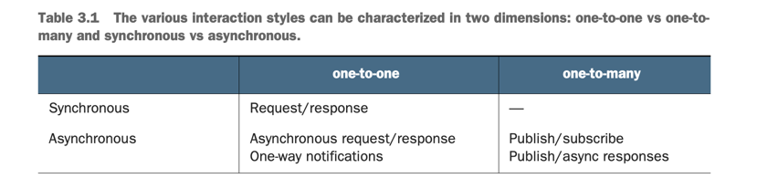
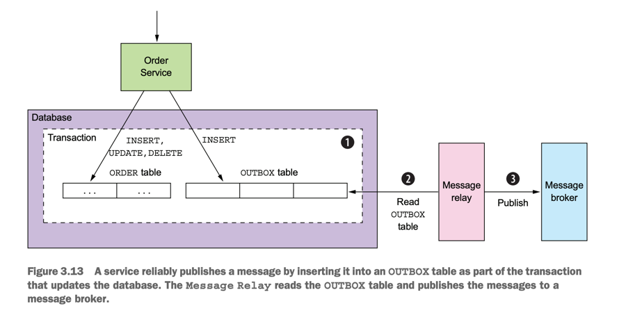
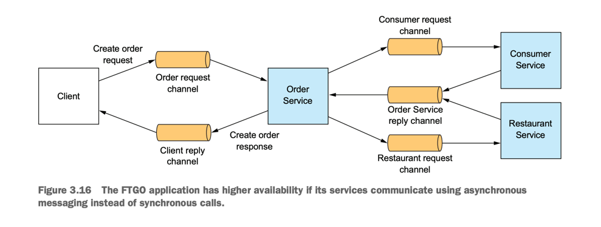
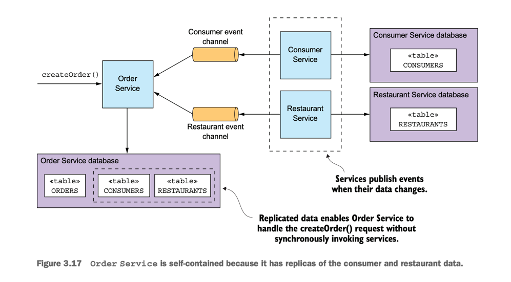

# Microservice Pattern with example in Java part 2

This page talks about lessons learned from the book <span className="layered-style">"Microservice Patterns with example in Java"</span> by Chris Richardson, so sentences are my own thoughts, not from the book.
<!--   style="color: #FF6F61;" -->

## Chapter 3:  Interprocess communication in a microservice architecture
This chapter covers:
- Applying the communication patterns: Remote
procedure invocation, Circuit breaker, Client-side
discovery, Self registration, Server-side discovery,
Third party registration, Asynchronous messaging,
Transactional outbox, Transaction log tailing,
Polling publisher
- The importance of interprocess communication in
a microservice architecture
- Defining and evolving APIs
- The various interprocess communication options
and their trade-offs
- The benefits of services that communicate using
asynchronous messaging
- Reliably sending messages as part of a database
transaction

### 3.1 Overview of interprocess communication in a microservice architecture

There are a variety of client-service interaction styles. As table 3.1 shows, they can
be categorized in two dimensions. The first dimension is whether the interaction is
one-to-one or one-to-many:

- One-to-one—Each client request is processed by exactly one service.
- One-to-many—Each request is processed by multiple services.

The second dimension is whether the interaction is synchronous or asynchronous:
- Synchronous—The client expects a timely response from the service and might
even block while it waits.
- Asynchronous—The client doesn’t block, and the response, if any, isn’t necessarily sent immediately



3.1.4 Message formats 

<span className="layered-style"> TEXT-BASED MESSAGE FORMATS vs BINARY MESSAGE FORMATS</span> 

ref: https://martin.kleppmann.com/2012/12/05/schema-evolution-in-avro-protocol-buffers-thrift.html

Protobuf vs Json
- Protobuf only save the value of the field, not the field name.
- Protobuf save the value as binary (boolean just 1 bit) instead of text (each word need min 1 byte), so it's smaller than Json.

### 3.2 Remote procedure invocation pattern

REST with IDL (interface definition language) - OpenAPI

<span className="layered-style"> THE CHALLENGE OF FETCHING MULTIPLE RESOURCES IN A SINGLE REQUEST</span>

For example, a client could retrieve an Order and its Consumer using GET /orders/order-id-1345?expand=consumer -> insufficient 

This has led to the increasing popularity of
alternative API technologies such as GraphQL (http://graphql.org) and Netflix Falcor
(http://netflix.github.io/falcor/), which are designed to support efficient data fetching


3.2.2 Using gRPC

3.2.3 Handling partial failure using the Circuit breaker pattern

It’s essential that you design your services to prevent partial failures from cascading
throughout the application. There are two parts to the solution:
- You must use design RPI proxies, such as OrderServiceProxy, to handle unresponsive remote services.
- You need to decide how to recover from a failed remote service

<span className="layered-style"> DEVELOPING ROBUST RPI PROXIES</span>

- Network timeouts
- Limiting the number of outstanding requests from a client to a service -> helping alert.
- Circuit breaker pattern

- Netflix Hystrix (https://github.com/Netflix/Hystrix) is an open source library that
implements these and other patterns. If you’re using the JVM, you should definitely
consider using Hystrix when implementing RPI proxies. And if you’re running in a
non-JVM environment, you should use an equivalent library.

<span className="layered-style"> RECOVERING FROM AN UNAVAILABLE SERVICE </span>

Using a library such as Hystrix is only part of the solution. You must also decide on a
case-by-case basis how your services should recover from an unresponsive remote service.

One option is return an error to its client, or fallback value such as either a default value or a
cached response.

3.2.4 Using service discovery

There are two main ways to implement service discovery:

- The services and their clients interact directly with the service registry.
- The deployment infrastructure handles service discovery. (I talk more about
that in chapter 12.)

### Communicating using the Asynchronous messaging pattern

<span className="layered-style"> Kind of message vs Kind of channel </span>
- Command message come with point-to-point channel
- Event message come with publish-subscribe channel

<span className="layered-style"> OVERVIEW OF BROKER-BASED MESSAGING </span>

When selecting a message broker, you have various factors to consider, including
the following:
- Supported programming languages—You probably should pick one that supports a
variety of programming languages.
- Supported messaging standards—Does the message broker support any standards,
such as AMQP and STOMP, or is it proprietary?
-  Messaging ordering—Does the message broker preserve ordering of messages?
-  Delivery guarantees—What kind of delivery guarantees does the broker make?
-  Persistence—Are messages persisted to disk and able to survive broker crashes?
-  Durability—If a consumer reconnects to the message broker, will it receive the messages that were sent while it was disconnected?
-  Scalability—How scalable is the message broker?
-  Latency—What is the end-to-end latency?
-  Competing consumers—Does the message broker support competing consumers?

<span className="layered-style">3.3.6 Handling duplicate messages </span>

There are a couple of different ways to handle duplicate messages:
- Write idempotent message handlers.
- Track messages and discard duplicates: A simple solution is for a message consumer to track the messages that it has processed using the message id and discard any duplicates

<span className="layered-style"> 3.3.7 Transactional messaging </span>

**Note: Write a blog talk about this TOPIC**

Both the database update and the sending of the message must happen within a transaction. Otherwise,
a service might update the database and then crash, for example, before sending the
message. If the service doesn’t perform these two operations atomically, a failure
could leave the system in an inconsistent state

The traditional solution is to use a distributed transaction that spans the database
and the message broker. But as you’ll learn in chapter 4, distributed transactions
aren’t a good choice for modern applications. Moreover, many modern brokers such
as Apache Kafka don’t support distributed transactions.

<span className="layered-style">USING A DATABASE TABLE AS A MESSAGE QUEUE </span>

Pattern: Transactional outbox
Publish an event or message as part of a database transaction by saving it in an OUTBOX in the database. See http://microservices.io/patterns/data/transactional-outbox.html.



The OUTBOX table acts a temporary message queue. The MessageRelay is a component that reads the OUTBOX table and publishes the messages to a message broker.  There are a couple of different ways to move messages from the database to the
message broker. We’ll look at each one.

<span className="layered-style">PUBLISHING EVENTS BY USING THE POLLING PUBLISHER PATTERN </span>

If the application uses a relational database, a very simple way to publish the messages
inserted into the OUTBOX table is for the MessageRelay to poll the table for unpublished messages. It periodically queries the table:

```sql
SELECT * FROM OUTBOX ORDERED BY ... ASC
```

Next, the MessageRelay publishes those messages to the message broker, sending one
to its destination message channel. Finally, it deletes those messages from the OUTBOX
table:

```sql
BEGIN
DELETE FROM OUTBOX WHERE ID in (....)
COMMIT
```

Pattern: Polling publisher
Publish messages by polling the outbox in the database. See http://microservices.io/patterns/data/polling-publisher.html.

- Downside is that frequently polling the database can be expensive

<span className="layered-style">PUBLISHING EVENTS BY APPLYING THE TRANSACTION LOG TAILING PATTERN </span>

A sophisticated solution is for MessageRelay to tail the database transaction log (also
called the commit log).

Pattern: Transaction log tailing
Publish changes made to the database by tailing the transaction log. See http://microservices.io/patterns/data/transaction-log-tailing.html.

There are a few examples of this approach in use:
- Debezium (http://debezium.io)—An open source project that publishes database changes to the Apache Kafka message broker.
- LinkedIn Databus (https://github.com/linkedin/databus)—An open source project that mines the Oracle transaction log and publishes the changes as events.
LinkedIn uses Databus to synchronize various derived data stores with the system of record.
- DynamoDB streams (http://docs.aws.amazon.com/amazondynamodb/latest/
developerguide/Streams.html)—DynamoDB streams contain the time-ordered
sequence of changes (creates, updates, and deletes) made to the items in a
DynamoDB table in the last 24 hours. An application can read those changes
from the stream and, for example, publish them as events.
- Eventuate Tram (https://github.com/eventuate-tram/eventuate-tram-core)—Your
author’s very own open source transaction messaging library that uses MySQL
binlog protocol, Postgres WAL, or polling to read changes made to an OUTBOX
table and publish them to Apache Kafka.


#### 3.3.8 Libraries and frameworks for messaging

Eventuate Tram also implements two important mechanisms:
- Transactional messaging—It publishes messages as part of a database transaction.
- Duplicate message detection—The Eventuate Tram message consumer detects and
discards duplicate messages, which is essential for ensuring that a consumer
processes messages exactly once, as discussed in section 3.3.6.

### 3.4 Using asynchronous messaging to improve availability

Problem with synchronous communication and how it impacts availability.
- Client must wait for the service to send a response, reduces availability

#### 3.4.2 Eliminating synchronous interaction

There are ways to handle synchronous requests without making synchronous requests. Let’s talk about the options.

<span className="layered-style">USE ASYNCHRONOUS INTERACTION STYLES </span>



Such an architecture would be extremely resilient, because the message broker
buffers messages until they can be consumed. The problem, however, is that services
often have an external API that uses a synchronous protocol such as REST, so it must
respond to requests immediately.

If a service has a synchronous API, one way to improve availability is to replicate
data. Let’s see how that works.

<span className="layered-style">REPLICATE DATA </span>



Another drawback of replication is that it doesn’t solve the problem of how a service updates data owned by
other services.

One way to solve that problem is for a service to delay interacting with other services until after it responds to its client. We’ll next look at how that works.

<span className="layered-style">FINISH PROCESSING AFTER RETURNING A RESPONSE </span>

Another way to eliminate synchronous communication during request processing is
for a service to handle a request as follows:
- 1 Validate the request using only the data available locally.
- 2 Update its database, including inserting messages into the OUTBOX table.
- 3 Return a response to its client.

While handling a request, the service doesn’t synchronously interact with any other
services. Instead, it asynchronously sends messages to other services. This approach
ensures that the services are loosely coupled. As you’ll learn in the next chapter, this is
often implemented using a _saga_.

Consequently, in order for the client to know whether the order
was successfully created, either it must periodically poll or Order Service must send it
a notification message

#### Summary
Care about Backward compatible

Synchronous remote procedure invocation-based protocols, such as REST, are the easiest to use. But services should ideally communicate using asynchronous messaging in order to
increase availability.

Care about partial failures, use Circuit breaker pattern, network timeout, limit the number of outstanding requests.

An architecture that uses synchronous protocols must include a service discovery mechanism -> ignore it now

One key challenge when using messaging is atomically updating the database
and publishing a message. A good solution is to use the Transactional outbox
pattern and first write the message to the database as part of the database transaction.  A separate process then retrieves the message from the database using
either the Polling publisher pattern or the Transaction log tailing pattern and
publishes it to the message broker.