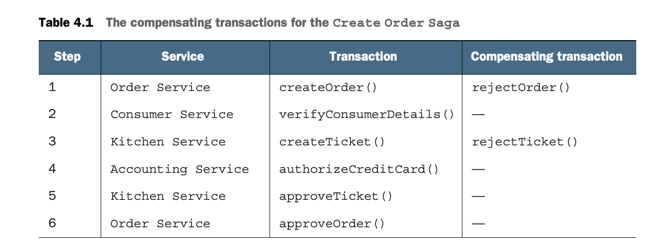
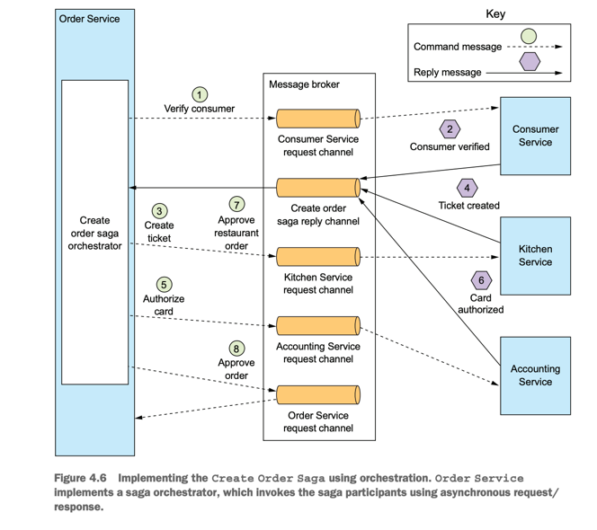
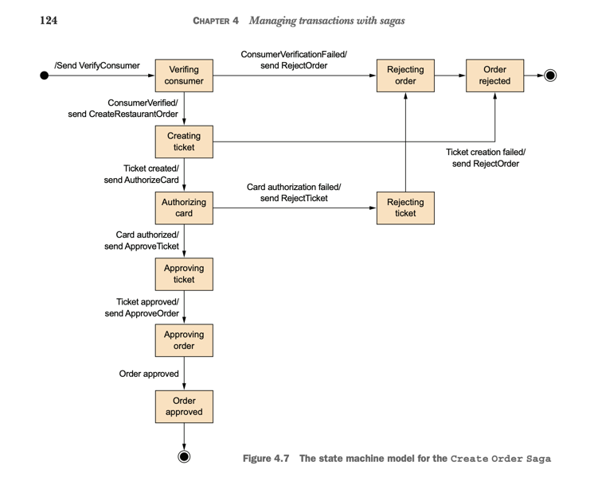
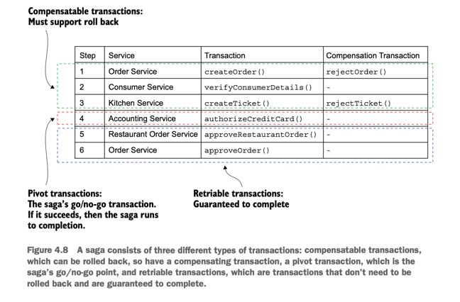

# Microservice Pattern with example in Java part 3

This page talks about lessons learned from the book "Microservice Patterns with example in Java" by Chris Richardson, so sentences are my own thoughts, not from the book.
<!--   style="color: #FF6F61;" -->

## Chapter 4:  Managing transactions with sagas

This chapter covers:
- Why distributed transactions aren’t a good fit for
modern applications
- Using the Saga pattern to maintain data
consistency in a microservice architecture
- Coordinating sagas using choreography and
orchestration
- Using countermeasures to deal with the lack of
isolation

One challenge with sagas is that they are ACD (Atomicity, Consistency,
Durability). They lack the isolation feature of traditional ACID transactions. As a
result, an application must use what are known as countermeasures, design techniques
that prevent or reduce the impact of concurrency anomalies caused by the lack of
isolation

In many ways, the biggest obstacle that Mary and the FTGO developers will face
when adopting microservices is moving from a single database with ACID transactions
to a multi-database architecture with ACD sagas.

https://www.enterpriseintegrationpatterns.com/ramblings/18_starbucks.html

Why the traditional approach to distributed
transaction management isn’t an option. How to maintain data consistency using sagas. After that I look at the two different ways of coordinating sagas:
choreography, where participants exchange events without a centralized point of control, and orchestration, where a centralized controller tells the saga participants what
operation to perform. I discuss how to use countermeasures to prevent or reduce the
impact of concurrency anomalies caused by the lack of isolation between sagas. Finally, I
describe the implementation of an example saga

### 4.1 Transaction management in a microservice architecture

Transaction management is more challenging in a complex monolithic
application that uses multiple databases and message brokers

#### 4.1.1 The need for distributed transactions in a microservice architecture
#### 4.1.2 The trouble with distributed transactions

#### 4.1.3 Using the Saga pattern to maintain data consistency

A saga is a sequence of local transactions. Each local transaction updates data within a single service using the
familiar ACID transaction frameworks and libraries mentioned earlier. See http://microservices.io/patterns/data/saga.html.

Sagas differ from ACID transactions in a couple of important ways. As I describe in
detail in section 4.3, they lack the isolation property of ACID transactions. Also, because
each local transaction commits its changes, a saga must be rolled back using compensating transactions. I talk more about compensating transactions later in this section. Let’s
take a look at an example saga.

AN EXAMPLE SAGA: THE CREATE ORDER SAGA 

Later, in section 4.2, I describe how the services that participate in a saga communicate using asynchronous messaging. A service publishes a message when a local transaction completes. This message then triggers the next step in the saga. Not only does
using messaging ensure the saga participants are loosely coupled, it also guarantees
that a saga completes. That’s because if the recipient of a message is temporarily
unavailable, the message broker buffers the message until it can be delivered.
On the surface, sagas seem straightforward, but there are a few challenges to using
them. One challenge is the lack of isolation between sagas. Section 4.3 describes how
to handle this problem. Another challenge is rolling back changes when an error
occurs. Let’s take a look at how to do that.

SAGAS USE COMPENSATING TRANSACTIONS TO ROLL BACK CHANGES 

If a local transaction fails, the saga’s coordination mechanism must execute compensating transactions that reject the Order and possibly the Ticket. Table 4.1 shows the
compensating transactions for each step of the Create Order Saga. It’s important to
note that not all steps need compensating transactions. Read-only steps, such as verifyConsumerDetails(), don’t need compensating transactions. Nor do steps such as
authorizeCreditCard() that are followed by steps that always succeed.

Section 4.3 discusses how the first three steps of the Create Order Saga are termed
**compensatable transactions** because they’re followed by steps that can fail, how the
fourth step is termed the saga’s Retriable because it’s followed by steps that never fail, and how the last two steps are termed **retriable transactions** because they
always succeed.

To see how compensating transactions are used, imagine a scenario where the
authorization of the consumer’s credit card fails. In this scenario, the saga executes
the following local transactions:
- 1 Order Service—Create an Order in an APPROVAL_PENDING state.
- 2 Consumer Service—Verify that the consumer can place an order.
- 3 Kitchen Service—Validate order details and create a Ticket in the CREATE_PENDING state.
- 4 Accounting Service—Authorize consumer’s credit card, which fails.
- 5 Kitchen Service—Change the state of the Ticket to CREATE_REJECTED.
- 6 Order Service—Change the state of the Order to REJECTED.

The fifth and sixth steps are compensating transactions that undo the updates made
by Kitchen Service and Order Service, respectively. A saga’s coordination logic is
responsible for sequencing the execution of forward and compensating transactions.
Let’s look at how that works.

### 4.2 Coordinating sagas

- Choreography—Distribute the decision making and sequencing among the saga
participants. They primarily communicate by exchanging events.
- Orchestration—Centralize a saga’s coordination logic in a saga orchestrator class.
  A saga orchestrator sends command messages to saga participants telling them
  which operations to perform

#### 4.2.1 Choreography-based sagas

Issue with choreography-based sagas

RELIABLE EVENT-BASED COMMUNICATION

- We must ensure database update and the publishing of the event happen atomically. 
Consequently, to communicate reliably, the saga participants must use transactional messaging, described in chapter 3.

BENEFITS AND DRAWBACKS OF CHOREOGRAPHY-BASED SAGAS
- More difficult to understand
- Cyclic dependencies between the service
- Risk of tight coupling

So we can use it for simple sagas, but for complex sagas, we should use orchestration-based sagas.

#### 4.2.2 Orchestration-based sagas

MODELING SAGA ORCHESTRATORS AS STATE MACHINES

BENEFITS AND DRAWBACKS OF ORCHESTRATION-BASED SAGAS

Simpler dependencies, Less coupling, Improves separation of concerns and simplifies the business logic

Orchestration also has a **DRAWBACK**: the risk of centralizing too much business logic in
the orchestrator. This results in a design where the smart orchestrator tells the dumb
services what operations to do. Fortunately, you can avoid this problem by designing
orchestrators that are solely responsible for sequencing and don’t contain any other
business logic.

Another, which is perhaps the biggest challenge that you’ll face when using sagas, is
handling the lack of isolation. Let’s take a look at that problem and how to solve it

### 4.3 Handling the lack of isolation

That’s because the updates made by each of a saga’s local transactions
are immediately visible to other sagas once that transaction commits. This behavior
can cause two problems. First, other sagas can change the data accessed by the saga
while it’s executing. And other sagas can read its data before the saga has completed
its updates, and consequently can be exposed to inconsistent data. You can, in fact,
consider a saga to be ACD:
- Atomicity—The saga implementation ensures that all transactions are executed
or all changes are undone.
- Consistency—Referential integrity within a service is handled by local databases.
Referential integrity across services is handled by the services.
- Durability—Handled by local databases

The next section discusses a set of saga design strategies that deal with the lack of
isolation. These strategies are known as countermeasures. Some countermeasures implement isolation at the application level. Other countermeasures reduce the business
risk of the lack of isolation. By using countermeasures, you can write saga-based business logic that works correctly.

I’ll begin the section by describing the anomalies that are caused by the lack of isolation. After that, I’ll talk about countermeasures that either eliminate those anomalies or reduce their business risk.

#### 4.3.1 Overview of anomalies

The lack of isolation can cause the following three anomalies:
- Lost updates—One saga overwrites without reading changes made by another saga.
- Dirty reads—A transaction or a saga reads the updates made by a saga that has
not yet completed those updates.
- Fuzzy/nonrepeatable reads—Two different steps of a saga read the same data and
get different results because another saga has made updates

LOST UPDATES

A lost update anomaly occurs when one saga overwrites an update made by another
saga. Consider, for example, the following scenario:
1. The first step of the Create Order Saga creates an Order.
2. While that saga is executing, the Cancel Order Saga cancels the Order.
3. The final step of the Create Order Saga approves the Order.

In this scenario, the Create Order Saga ignores the update made by the Cancel Order
Saga and overwrites it. As a result, the FTGO application will ship an order that the
customer had cancelled. Later in this section, I’ll show how to prevent lost updates.

DIRTY READS

A dirty read occurs when one saga reads data that’s in the middle of being updated by
another saga. Consider, for example, a version of the FTGO application store where
consumers have a credit limit. In this application, a saga that cancels an order consists
of the following transactions:
- Consumer Service—Increase the available credit.
- Order Service—Change the state of the Order to cancelled.
- Delivery Service—Cancel the delivery.

Let’s imagine a scenario that interleaves the execution of the Cancel Order and Create
Order Sagas, and the Cancel Order Saga is rolled back because it’s too late to cancel
the delivery. It’s possible that the sequence of transactions that invoke the Consumer
Service is as follows:
1. Cancel Order Saga—Increase the available credit.
2. Create Order Saga—Reduce the available credit.
3. Cancel Order Saga—A compensating transaction that reduces the available credit.

In this scenario, the Create Order Saga does a dirty read of the available credit that
enables the consumer to place an order that exceeds their credit limit. It’s likely that
this is an unacceptable risk to the business.
Let’s look at how to prevent this and other kinds of anomalies from impacting an
application

#### 4.3.2 Countermeasures for handling the lack of isolation

The countermeasures described by this paper are as follows:
-  Semantic lock—An application-level lock.
-  Commutative updates—Design update operations to be executable in any order.
-  Pessimistic view—Reorder the steps of a saga to minimize business risk.
-  Reread value—Prevent dirty writes by rereading data to verify that it’s unchanged before overwriting it.
-  Version file—Record the updates to a record so that they can be reordered.
-  By value—Use each request’s business risk to dynamically select the concurrency mechanism.

COUNTERMEASURE: SEMANTIC LOCK

