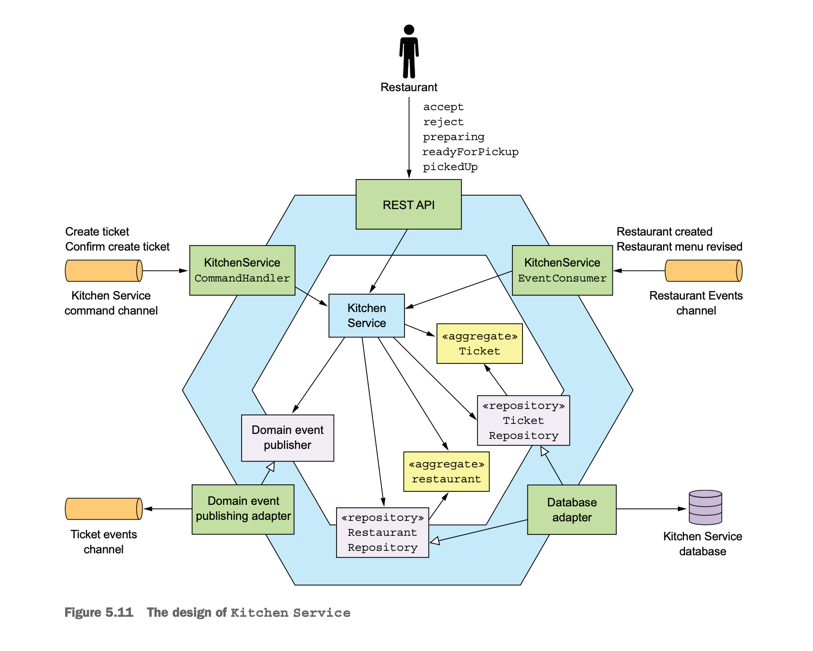
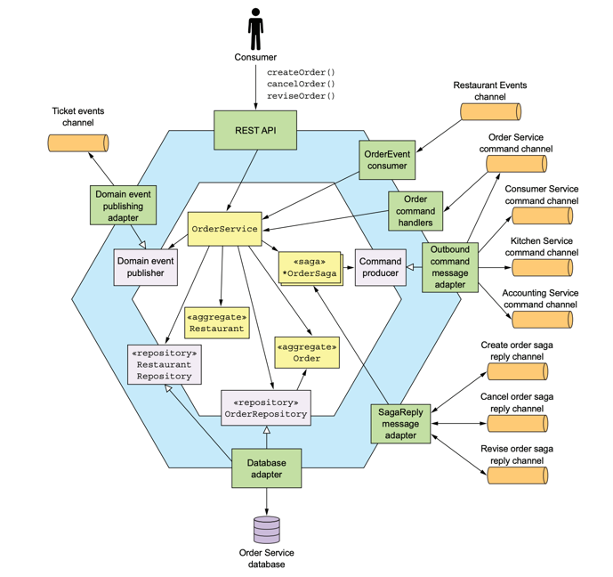
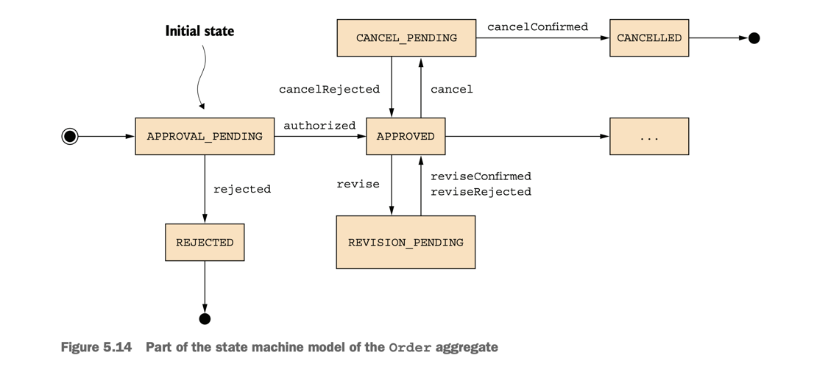

# Microservice Pattern with example in Java part 5

This page talks about lessons learned from the book <span className="layered-style">"Microservice
Patterns with example in Java"</span> by Chris Richardson, so sentences are my own thoughts, not
from the book.
<!--   style="color: #FF6F61;" -->

## Chapter 5: Designing business logic in a microservice architecture

This chapter covers

- Applying the business logic organization patterns: Transaction
  script pattern and Domain model pattern
- Designing business logic with the Domain-driven design (DDD) aggregate pattern
- Applying the Domain event pattern in a microservice architecture

### 5.3 Publishing domain events

#### 5.3.5 Generating and publishing domain events

```java
public class Ticket {

  public List<DomainEvent> accept(ZonedDateTime readyBy) {
...
    this.acceptTime = ZonedDateTime.now();
    this.readyBy = readyBy;
    return singletonList(new TicketAcceptedEvent(readyBy));
  }
}
```

```java
public class KitchenService {

  @Autowired
  private TicketRepository ticketRepository;
  @Autowired
  private DomainEventPublisher domainEventPublisher;

  public void accept(long ticketId, ZonedDateTime readyBy) {
    Ticket ticket =
        ticketRepository.findById(ticketId)
            .orElseThrow(() ->
                new TicketNotFoundException(ticketId));
    List<DomainEvent> events = ticket.accept(readyBy);
    domainEventPublisher.publish(Ticket.class, orderId, events);
  }
}
```

HOW TO RELIABLY PUBLISH DOMAIN EVENTS?

#### 5.3.6 Consuming domain events

```java
public class KitchenServiceEventConsumer {

  @Autowired
  private RestaurantService restaurantService;

  public DomainEventHandlers domainEventHandlers() {
    return DomainEventHandlersBuilder
        .forAggregateType("net.chrisrichardson.ftgo.restaurantservice.Restaurant")
        .onEvent(RestaurantMenuRevised.class, this::reviseMenu)
        .build();
  }

  public void reviseMenu(DomainEventEnvelope<RestaurantMenuRevised> de) {
    long id = Long.parseLong(de.getAggregateId());
    RestaurantMenu revisedMenu = de.getEvent().getRevisedMenu();
    restaurantService.reviseMenu(id, revisedMenu);
  }
}
```








