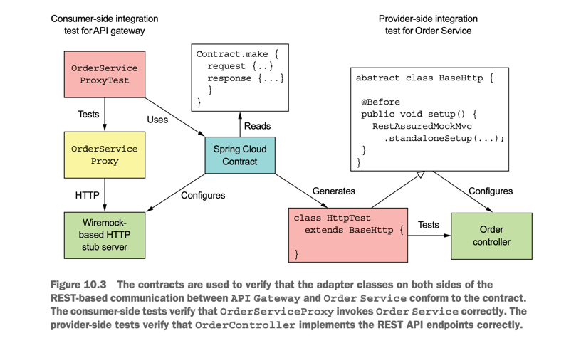

# Microservice Pattern with example in Java part 7

This page talks about lessons learned from the book "Microservice
Patterns with example in Java" by Chris Richardson, so sentences are my own thoughts, not
from the book.
<!--   style="color: #FF6F61;" -->

## Chapter 7: Implementing queries in a microservice architecture

There are two different patterns for implementing query operations in a microservice architecture:

- The API composition pattern—This is the simplest approach and should be used
whenever possible. It works by making clients of the services that own the data
responsible for invoking the services and combining the results.
- The Command query responsibility segregation (CQRS) pattern—This is more powerful than the API composition pattern, but it’s also more complex. It maintains
one or more view databases whose sole purpose is to support queries.

## Chapter 8: External API patterns

DESIGNING APIS FOR THIRD-PARTY APPLICATIONS

maintaining long-term backward compatibility

8.2.1 Overview of the API gateway pattern

IMPLEMENTING EDGE FUNCTIONS

- Authentication—Verifying the identity of the client making the request.
- Authorization—Verifying that the client is authorized to perform that particular
operation.
- Rate limiting —Limiting how many requests per second from either a specific client and/or from all clients.
- Caching—Cache responses to reduce the number of requests made to the services.
- Metrics collection—Collect metrics on API usage for billing analytics purposes.
- Request logging—Log requests.

## CHAPTER 9: Testing microservices: Part 1

consumer-driven contract testing

Two popular contract testing frameworks are Spring Cloud Contract (https://cloud.spring.io/spring-cloud-contract/), which is a consumer contract testing framework
for Spring applications, and the Pact family of frameworks (https://github.com/pactfoundation), which support a variety of languages.

- https://docs.spring.io/spring-cloud-contract/reference/using/provider-contract-testing-with-stubs-in-git.html

- https://github.com/pact-foundation/pact-workshop-jvm-spring

#### 9.2.4 Writing unit tests for domain services

#### 9.2.5 Developing unit tests for controllers

## CHAPTER 10: Testing microservices: Part 2

