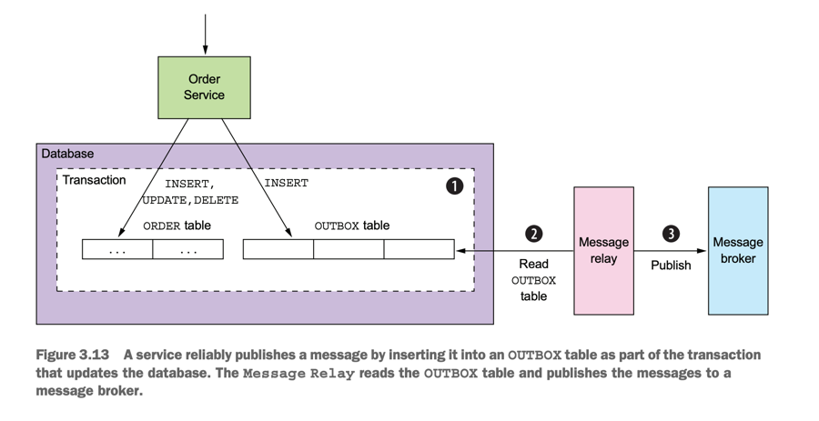

# Microservice Pattern with example - minimized.

This page talks about lessons learned from the book <span className="layered-style">"Microservice Patterns with example in Java"</span> by Chris Richardson, so sentences are my own thoughts, not from the book.
<!--   style="color: #FF6F61;" -->

Both the database update and the sending of the message must happen within a transaction. Otherwise,
a service might update the database and then crash, for example, before sending the
message. If the service doesn’t perform these two operations atomically, a failure
could leave the system in an inconsistent state

The traditional solution is to use a distributed transaction that spans the database
and the message broker. But as you’ll learn in chapter 4, distributed transactions
aren’t a good choice for modern applications. Moreover, many modern brokers such
as Apache Kafka don’t support distributed transactions.

<span className="layered-style">USING A DATABASE TABLE AS A MESSAGE QUEUE </span>

Pattern: Transactional outbox
Publish an event or message as part of a database transaction by saving it in an OUTBOX in the database. See http://microservices.io/patterns/data/transactional-outbox.html.



The OUTBOX table acts a temporary message queue. The MessageRelay is a component that reads the OUTBOX table and publishes the messages to a message broker.  There are a couple of different ways to move messages from the database to the
message broker. We’ll look at each one.

<span className="layered-style">PUBLISHING EVENTS BY USING THE POLLING PUBLISHER PATTERN </span>

If the application uses a relational database, a very simple way to publish the messages
inserted into the OUTBOX table is for the MessageRelay to poll the table for unpublished messages. It periodically queries the table:

```sql
SELECT * FROM OUTBOX ORDERED BY ... ASC
```

Next, the MessageRelay publishes those messages to the message broker, sending one
to its destination message channel. Finally, it deletes those messages from the OUTBOX
table:

```sql
BEGIN
DELETE FROM OUTBOX WHERE ID in (....)
COMMIT
```

Pattern: Polling publisher
Publish messages by polling the outbox in the database. See http://microservices.io/patterns/data/polling-publisher.html.

- Downside is that frequently polling the database can be expensive

<span className="layered-style">PUBLISHING EVENTS BY APPLYING THE TRANSACTION LOG TAILING PATTERN </span>

A sophisticated solution is for MessageRelay to tail the database transaction log (also
called the commit log).

Pattern: Transaction log tailing
Publish changes made to the database by tailing the transaction log. See http://microservices.io/patterns/data/transaction-log-tailing.html.

There are a few examples of this approach in use:
- Debezium (http://debezium.io)—An open source project that publishes database changes to the Apache Kafka message broker.
- LinkedIn Databus (https://github.com/linkedin/databus)—An open source project that mines the Oracle transaction log and publishes the changes as events.
  LinkedIn uses Databus to synchronize various derived data stores with the system of record.
- DynamoDB streams (http://docs.aws.amazon.com/amazondynamodb/latest/
  developerguide/Streams.html)—DynamoDB streams contain the time-ordered
  sequence of changes (creates, updates, and deletes) made to the items in a
  DynamoDB table in the last 24 hours. An application can read those changes
  from the stream and, for example, publish them as events.
- Eventuate Tram (https://github.com/eventuate-tram/eventuate-tram-core)—Your
  author’s very own open source transaction messaging library that uses MySQL
  binlog protocol, Postgres WAL, or polling to read changes made to an OUTBOX
  table and publish them to Apache Kafka.


