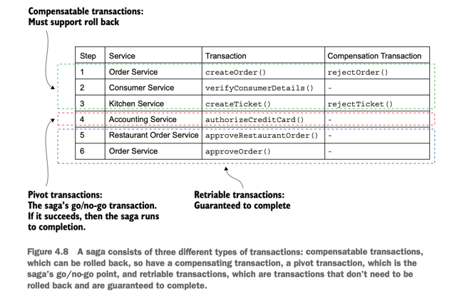

# Reflect

This page talks about lessons learned from the book "Microservice Patterns with example in Java" by Chris Richardson, so sentences are my own thoughts, not from the book.
<!--   style="color: #FF6F61;" -->

## Chapter 4:  Managing transactions with sagas
#### 4.3.2 Countermeasures for handling the lack of isolation

The countermeasures described by this paper are as follows:
-  Semantic lock—An application-level lock.
-  Commutative updates—Design update operations to be executable in any order.
-  Pessimistic view—Reorder the steps of a saga to minimize business risk.
-  Reread value—Prevent dirty writes by rereading data to verify that it’s unchanged before overwriting it.
-  Version file—Record the updates to a record so that they can be reordered.
-  By value—Use each request’s business risk to dynamically select the concurrency mechanism.

COUNTERMEASURE: SEMANTIC LOCK

## Chapter 5: Designing business logic in a microservice architecture

This chapter covers
- Applying the business logic organization patterns: Transaction 
script pattern and Domain model pattern
- Designing business logic with the Domain-driven  design (DDD) aggregate pattern
- Applying the Domain event pattern in a  microservice architecture

