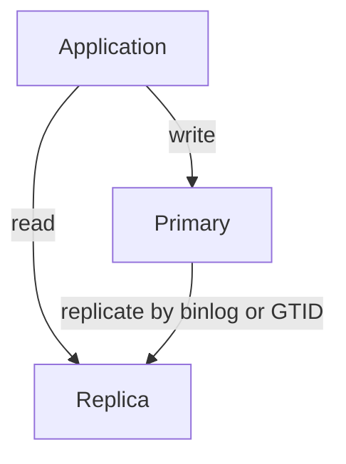
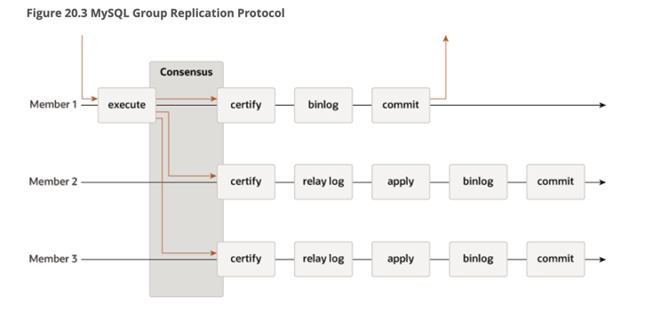
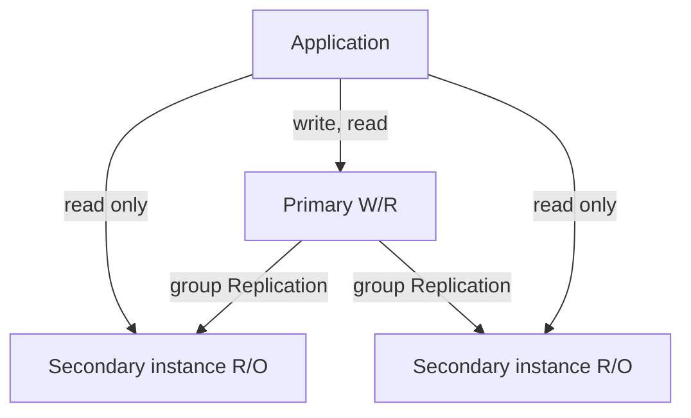
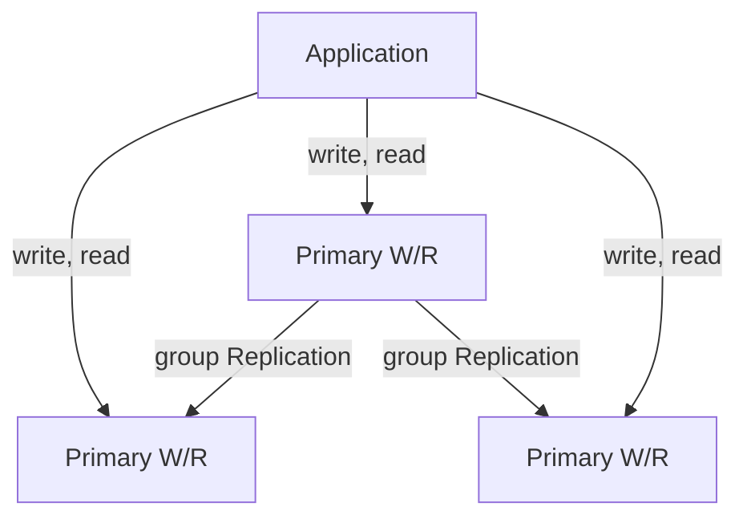
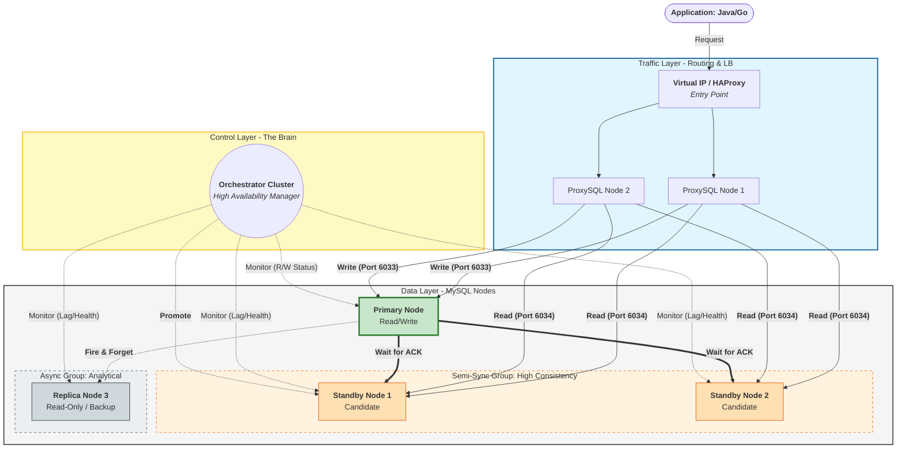

import MultipleChoice from '@site/src/components/MultipleChoice';
import CodeBlock from '@theme/CodeBlock';
import MatchingGame from '@site/src/components/MatchingGame';

# Mysql Database deployment

## Tại sao chúng ta cần nhiều cách deploy ?

Nối các `bài toán bên trái` dưới đây với `yếu tố bên phải` mà bạn cần quan tâm nhất:

<MatchingGame
  pairs={[
    { id: 1, left: "Vấn đề: Hệ thống chỉ có 1 Node duy nhất", right: "Cần chú ý High Availability (SPOF), zero downtime -> Auto-failover -> Multi tier" },
    { id: 2, left: "Muốn 100k reads per second", right: "Cần Scalability by replica" },
    { id: 3, left: "Muốn 100k writes per second", right: " Cần scalability by sharding" },
    { id: 4, left: "Vấn đề: data cần realtime hay không ?", right: "Cần chú ý Consistency (Eventual or not)" },
    { id: 5, left: "Vấn đề: app có 100 users mà deploy 3 node database", right: "Cần tối ưu Cost (Chi phí)" },
    { id: 6, left: "Muốn latency < 100ms", right: "Cần chú ý Performance" },
    { id: 7, left: "Vấn đề: Iran đánh bom data center của bạn ?", right: "Cần Disaster recovery" },
  ]}
  feedbackSuccess="Thường thôi :v"
/>

## Prerequisites

### How many [Engines](https://dev.mysql.com/doc/refman/9.7/en/storage-engines.html) that mysql support ?

<details>
	<summary>SHOW ENGINES</summary>

```sql
mysql> SHOW ENGINES\G
*************************** 1. row ***************************
      Engine: PERFORMANCE_SCHEMA
     Support: YES
     Comment: Performance Schema
Transactions: NO
          XA: NO
  Savepoints: NO
*************************** 2. row ***************************
      Engine: InnoDB
     Support: DEFAULT
     Comment: Supports transactions, row-level locking, and foreign keys
Transactions: YES
          XA: YES
  Savepoints: YES
*************************** 3. row ***************************
      Engine: MRG_MYISAM
     Support: YES
     Comment: Collection of identical MyISAM tables
Transactions: NO
          XA: NO
  Savepoints: NO
*************************** 4. row ***************************
      Engine: BLACKHOLE
     Support: YES
     Comment: /dev/null storage engine (anything you write to it disappears)
Transactions: NO
          XA: NO
  Savepoints: NO
*************************** 5. row ***************************
      Engine: MyISAM
     Support: YES
     Comment: MyISAM storage engine
Transactions: NO
          XA: NO
  Savepoints: NO
...
```
</details>

<details>
	<summary>Tại sao Mysql lại hỗ trợ nhiều loại engine ?</summary>

| Engine | Độ phổ biến | Cơ chế lưu trữ (Storage Structure) | Cơ chế khóa (Locking) | Mục đích sử dụng thực tế (Best For) |
| :--- | :---: | :--- | :--- | :--- |
| **InnoDB** | **~95%** | **Clustered Index (B+Tree)**: Dữ liệu sắp xếp theo Primary Key. Hỗ trợ MVCC. | **Row-level locking**: Chỉ khóa dòng đang sửa, hỗ trợ ghi đồng thời cao. | Hệ thống giao dịch (Fintech), cần tính toàn vẹn dữ liệu tuyệt đối (**ACID**). |
| **MyISAM** | **~2-3%** | **Non-clustered**: Dữ liệu và Index tách riêng. Không có rollback/crash-recovery. | **Table-level locking**: Khóa cả bảng khi ghi, các lệnh đọc phải chờ. | Các bảng Read-only, log đơn giản hoặc hệ thống cũ cần tiết kiệm tài nguyên. |
| **Memory** | **~1-2%** | **In-memory (Hash)**: Dữ liệu nằm hoàn toàn trên RAM. Mất dữ liệu khi restart. | **Table-level locking**: Tốc độ cực nhanh vì không tốn Disk I/O. | Bảng tạm (temporary tables), Cache dữ liệu cần truy xuất cực nhanh bằng Key. |
| **Archive** | **< 1%** | **Compressed**: Nén dữ liệu cực mạnh. Chỉ cho phép `INSERT` và `SELECT`. | **Row-level locking** (Insert): Tối ưu cho việc ghi liên tục. | Lưu trữ Audit logs khổng lồ hoặc dữ liệu lịch sử rất ít khi đọc lại. |
</details>

<details>
	<summary>Trong bài này chúng ta chỉ tập trung vào InnoDb (The default storage engine in MySQL)</summary>

InnoDB is a transaction-safe (**ACID compliant**) storage engine for MySQL that has commit, rollback, and crash-recovery capabilities to protect user data. **InnoDB row-level locking** (without escalation to coarser granularity locks) and Oracle-style consistent nonlocking reads increase multi-user concurrency and performance. InnoDB stores user data in clustered indexes to reduce I/O for common queries based on primary keys. To maintain data integrity, InnoDB also **supports FOREIGN KEY** referential-integrity constraints.
</details>

### What is [binlog](https://dev.mysql.com/doc/refman/9.7/en/binary-log.html) ?

1. Hãy tưởng tượng bạn có 1 finite state machine
```text
----state machine----
x = 0
```
2. Bạn lưu lại commands theo thứ tự (in order). Trạng thái (state) của FSM tại 1 index sẽ là như nhau.
```text
0. insert y        => x = 0, y = 0
1. update x = 3    => x = 3, y = 0
2. update y = 6    => x = 3, y = 6
```

`Ứng dụng`:
- Khôi phục lại trạng thái của Primary nếu gặp failure. (gặp failure ở index 1, apply từ index 2 trở đi.)
- Replicate trạng thái của Primary lên các Replicas. (chạy toàn bộ command lên 1 FSM khác, bạn sẽ có chung state với primary - eventually)

`Binlog` chính là file lưu các commands theo thứ tự trên.
- note: execute xong command mới lưu vào binlog (sẽ được bàn luận tiếp).

<details>
	<summary>Định nghĩa từ mysql document</summary>

The binary log contains “events” that describe database changes such as table creation operations or changes to table data. The binary log has two important purposes:
- [For replication](https://dev.mysql.com/doc/refman/9.7/en/replication-implementation.html), the binary log on a replication source server provides a record of the data changes to be sent to replicas.
- Certain data recovery operations require use of the binary log. After a backup has been restored, the events in the binary log that were recorded after the backup was made are re-executed. ref: [Point-in-Time (Incremental) Recovery](https://dev.mysql.com/doc/refman/9.7/en/point-in-time-recovery.html)

</details>

### What is [relay log](https://dev.mysql.com/doc/refman/9.7/en/replica-logs-relaylog.html)?

Tại sao có `bin log` rồi mà còn cần `relay log`?

`Context`: State machine ở replica - binlog chỉ được viết sau khi execute.
Tưởng tượng primary gửi command liên tục cho replicas, mà replicas phải execute xong mới ghi vào binlog.
Bạn sẽ gặp các vấn đề gì ?
- Các commands rất nặng, replicas mất 30s để thực thi xong rồi mới ghi vào binlog.
- Nếu cứ để commands trên RAM rồi thực hiện thì command có thể làm tràn Ram.

`Mục đích`: relay log sinh ra để tách việc IO từ network và execute từ DB. Ngay khi nhận command từ Primary,
Replica sẽ ghi ngay vào relay log.

{/* style={{ maxWidth: '60%', height: 'auto' } */}
{/*  bỏ image vô static/img/ mới dùng được cách này*/}


Từ hình trên, chúng ta sẽ đi tới 2 cách replication synchronization

### What is [Replication](https://trandanhhoang.github.io/docs/fundamental/26-05-01-Types-of-mysql-replication-synchronization)?

**[Replication](https://dev.mysql.com/doc/refman/9.7/en/replication.html)** is the way Primary sync data to Replicas. There are two ways below.
- Asynchronous (**default**): one-way, in that 1 server acts as a source, 1 or more other servers act as replicas.
- Semi-asynchronous: block the session from the primary until **at least one** replica acknowledge and write to **relay log (no need commit in DB)**

<div id="async-replication-reason">
  <MultipleChoice
    question={
        <>
          <p>Why is <b>Asynchronous Replication</b> the default mechanism of MySQL instead Semi-synchronous?</p>
        </>
      }
    options={[
      "It guarantee `zero data loss` during primary failure",
      "Increase performance (latency when write), because Primary don't need to wait Replicas",
    ]}
    correctIndex={1}
    feedback={[
      "WRONG. Async has a highest risk if Primary down before log have not been sent yet.",
      "CORRECT. It is ideal for majority of web apps.",
    ]}
  />
</div>

#### [Replication methods](https://dev.mysql.com/doc/refman/9.7/en/replication-configuration.html)
`Binlog (File-based positioning replication)`: Row-based logging is the default method, [see also](https://dev.mysql.com/doc/refman/9.7/en/replication-formats.html).
Ví dụ: UPDATE accounts SET balance = balance + 10, last_updated = NOW() WHERE filter;
- Statement-based (SBR): ghi lại duy nhất 1 lệnh trên.
- Row-based (RBR): ghi lại trạng thái sau khi update, nếu lệnh trên filter với 100 dòng, sẽ có 100 lệnh được ghi vào binlog.
	- ví dụ: ID=1: SET balance=110, last_updated='2026-05-03 20:00:00', ... tương tự cho 99 lệnh còn lại

`GTID (Transaction-based replication)`: extend từ binlog, không quan tâm là SBR hay RBR [see also](https://dev.mysql.com/doc/refman/9.7/en/replication-gtids.html)
- Source_UUID: Định danh của server nơi transaction sinh ra.
- Transaction_ID: Một con số tăng dần theo trình tự commit (Sequence Number).

ví dụ GTID: `GTID_EVENT: AAAA-BBBB-CCCC:100`, replica chỉ check id này đã được chạy hay chưa, chưa thì đọc SBR hoặc RBR bên trong để thực thi.

Các vấn đề có thể gặp với File-based mà GTID có thể xử lý được:
- Failover Inconsistency: Khi 1 replica B lên làm Primary, replica C còn lại sẽ khó để đồng bộ.

## Type of deployments 

### Single instance

Cons: single point of failure, can't scale

### Primary - replica



Đánh giá:
- HA tốt hơn, nhưng gặp vấn đề lost data khi primary failover
- Có thể Scale read bằng replicas, nhưng eventually consistency

### Group replication



Leverage consensus algorithm (Paxos-based consensus protocol) - quite like raft.

Types: Single-primary-mode and Multi-primary-mode

#### Single-primary-mode



Pros:
- HA: automatic fail over
- consistency: strong
- scale: write and read ([single-primary](https://dev.mysql.com/doc/refman/9.7/en/group-replication-single-primary-mode.html) || [multi-primary](https://dev.mysql.com/doc/refman/9.7/en/group-replication-multi-primary-mode.html))

Cons:
- performance: lag when write.

#### Multi-primary-mode


Cons: deadlock if use Optimistic Lock with high write service.

## Mysql framework - InnoDB

| Framework              | Components                        | Main Goal                        | Mechanism                                     |
|:-----------------------|:----------------------------------|:---------------------------------|:----------------------------------------------|
| **[InnoDB Cluster](https://dev.mysql.com/doc/refman/5.7/en/mysql-innodb-cluster-introduction.html)** | MySQL Server, Shell, Router       | High Availability                | **Group Replication** (Paxos)                 |
| **InnoDB ClusterSet**  | Multi InnoDB Clusters             | Disaster Recovery (DR)           | **Asynchronous Replication** between Clusters | 
| **InnoDB ReplicaSet**  | MySQL Server, Shell, Router       | Primary-Replica - Read Scale-out | **Asynchronous Replication**                  |
 
## Analyze components in InnoDB Cluster
- Shell: Oschestrator, change from Single-Primary to Multi-Primary with only 1 command.
- Router: Communication with application to hide topology, detect primary.
  - MySQL Router (from MySQL team, layer 4)
  - ProxySQL (Opensource work as layer 7)
- Mysqk Server



Traffic layer: proxy/load balancer (ProxySQL, HAProxy, or MySQL Router)

Control layer: failover manager (Orchestrator, MHA, or even manual for testing)

Data layer: MySQL nodes (1 primary + replicas)
- 1 primary (write)
- 2 replicas (read)
- GTID enabled (so failover is easier)
    - GTID stand for global transaction identifier. It's unique identifier created and assigned to every tx that is commited in primary server.

## Practice - deploy InnoDB Cluster with 3 nodes (1 primary, 2 replicas) on local machine using Docker.
Follow [oracle blog](https://dev.mysql.com/blog-archive/docker-compose-setup-for-innodb-cluster/)


