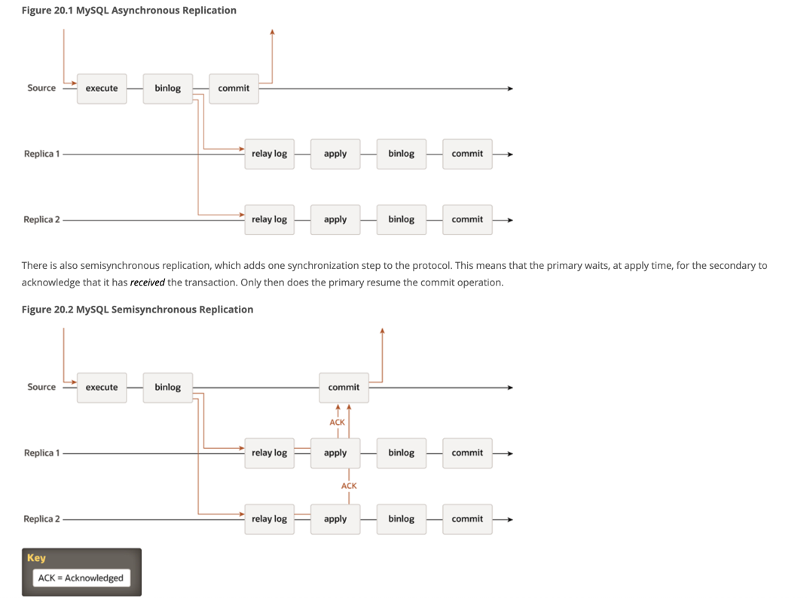

# Types of mysql replication synchronization

## Asynchronous Replication (The Default)
This is the traditional, built-in replication method in MySQL. In this model, the Source server does not care about the state of the Replicas once it has written the data locally.

How it works:
- The client sends a write request to the Source.
- The Source executes the transaction, writes it to its Binary Log (Binlog), and commits it to the storage engine.
- The Source immediately returns a success message to the client.
- In the background, Replicas connect to the Source, pull the Binlog events, write them to their local Relay Log, and eventually execute them.

## Semisynchronous Replication
Introduced via a plugin, this model provides a safety net against data loss by ensuring at least one Replica has received the transaction before the Source considers it complete.

How it works:
- The client sends a write request to the Source.
- The Source executes the transaction and writes it to the Binlog.
- The Source sends the event to the Replicas and pauses.
- At least one Replica receives the event, writes it to its local Relay Log (it does not need to execute it yet), and sends an acknowledgment (ACK) back to the Source.
- Once the Source receives the ACK, it commits the transaction and returns success to the client.

## Synchronous - NDB Cluster
In purely synchronous replication, a transaction is not considered complete until it has been successfully committed on all nodes (or a strict quorum of nodes) in the cluster.

How it works:
- In MySQL NDB Cluster, it uses a Two-Phase Commit (2PC) protocol. The data is synchronously written to multiple storage nodes at the exact same time.
- In MySQL Group Replication (InnoDB Cluster), it uses a Paxos-based consensus algorithm. A transaction must be certified and agreed upon by a majority of nodes before it is committed.

