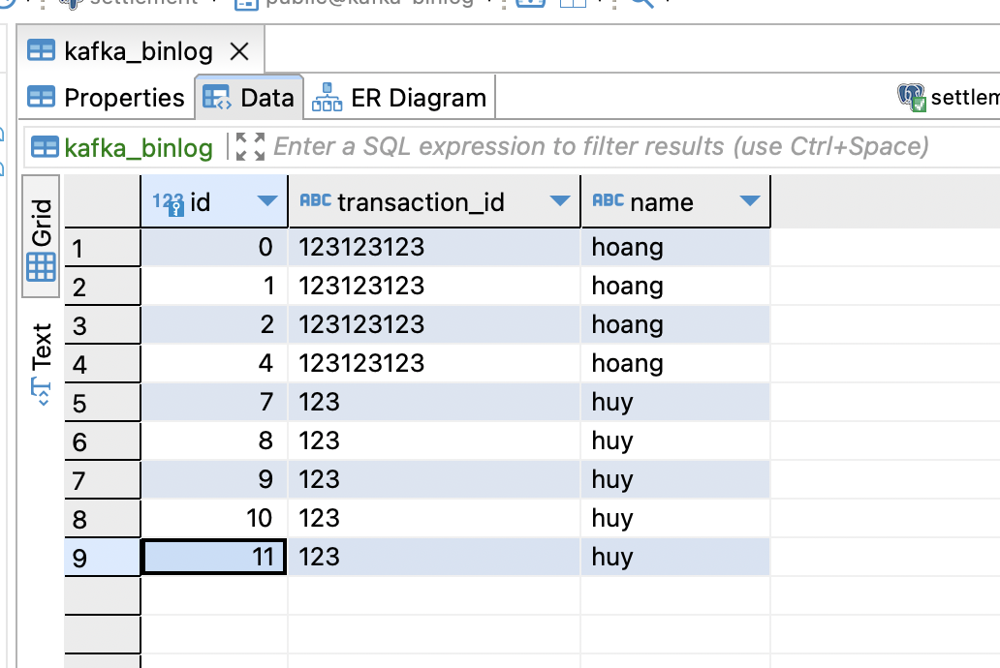
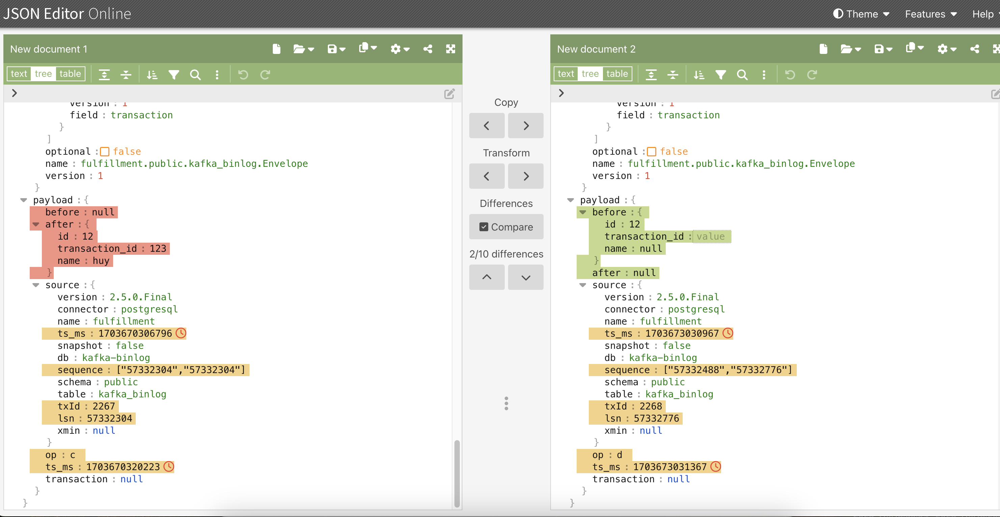

# Set up debezium with postgres

## Tóm tắt
- Nếu bạn giao tiếp giữa các service **_để thông báo có sự thay đổi của database_**, dù cho bạn dùng REST, kafka, rabbit-mq, message có thể drop vì nhiều lí do, ví dụ:
  - Nếu giao tiếp REST (Service A-> Service B)
    - Service B bị down, message mất
  - Kafka hoặc Rabbitmq:
    - Producer gửi message không thành công, lỗi network, hoặc lỗi bất kì
  - Lỗi ngay từ service A:
    - Bạn code sai khiến chưa tới bước send message thì đã bị lỗi.
- Debezium đọc data từ bin-log, nên **_message thông báo sự thay đổi của db_** sẽ không bao giờ bị thiếu.

## What you got
- Khi update database, debezium sẽ bắn message lên topic kafka, bạn có thể đọc message từ đây để làm gì tuỳ thích.

## Hiện thực
- Bước 1: Set up docker-compose (mình sẽ dùng lại ảnh docker-compose của bài kafka cũ)[kafka-springboot](https://trandanhhoang.github.io/docs/java-springboot/kafka-with-java-springboot-example)
và thêm vào ảnh của debezium
```yaml
version: '3.8'
name: spring-self-learn
services:
  zookeeper:
    container_name: local-zookeeper
    image: 'zookeeper:latest'
    ports:
      - '2181:2181'
    environment:
      - ZOOKEEPER_CLIENT_PORT=2181
      - ALLOW_ANONYMOUS_LOGIN=yes
  kafka:
    image: 'bitnami/kafka:latest'
    ports:
      - '29092:29092'
      - '9092:9092'
    environment:
      - KAFKA_BROKER_ID=0
      - KAFKA_CFG_ZOOKEEPER_CONNECT=zookeeper:2181
      - ALLOW_PLAINTEXT_LISTENER=yes
      - KAFKA_CFG_INTER_BROKER_LISTENER_NAME=INTERNAL
      - KAFKA_CFG_LISTENERS=PLAINTEXT_DEBEZIUM://:29092,PLAINTEXT_UI://:9091,PLAINTEXT://:9092,INTERNAL://kafka:9093
      - KAFKA_CFG_ADVERTISED_LISTENERS=PLAINTEXT_DEBEZIUM://kafka:29092,PLAINTEXT_UI://kafka:9091,PLAINTEXT://localhost:9092,INTERNAL://kafka:9093
      - KAFKA_CFG_LISTENER_SECURITY_PROTOCOL_MAP=PLAINTEXT_DEBEZIUM:PLAINTEXT,INTERNAL:PLAINTEXT,PLAINTEXT:PLAINTEXT,PLAINTEXT_UI:PLAINTEXT
    depends_on:
      - zookeeper
  postgres:
    image: postgres:15.5-alpine
    restart: always
    ports:
      - "5432:5432"
    environment:
      POSTGRES_USER: postgres
      POSTGRES_PASSWORD: postgres
      POSTGRES_DB: local-transaction
    command: ['postgres', '-c', 'wal_level=logical']
    volumes:
      - local-postgres-v15:/var/lib/postgresql/data
  debezium:
    image: quay.io/debezium/connect:2.4
    ports:
      - "8083:8083"
    environment:
      - BOOTSTRAP_SERVERS=kafka:29092
      - GROUP_ID=1
      - CONFIG_STORAGE_TOPIC=my_connect_configs
      - OFFSET_STORAGE_TOPIC=my_connect_offsets
      - STATUS_STORAGE_TOPIC=my_connect_statuses
      - KEY_CONVERTER=org.apache.kafka.connect.json.JsonConverter
      - VALUE_CONVERTER=org.apache.kafka.connect.json.JsonConverter
      - ENABLE_DEBEZIUM_SCRIPTING='true'
    links:
      - kafka
      - postgres
    depends_on:
      - kafka
    volumes:
      - ./debezium-connector-postgres:/kafka/connect/debezium-connector-postgres
```
- Bước 2: bạn sẽ thấy ở trên debezium dùm 1 thư mục, tải ở trang của debezium về, đặt vào thư mục đó.
  - https://debezium.io/documentation/reference/0.9/connectors/postgresql.html#connector-properties
    - tại dòng **Simply download the _connector’s plugin archive_**, bấm để tải
```
Deploying a Connector
If you’ve already installed Zookeeper, Kafka, and Kafka Connect, then using Debezium’s PostgreSQL connector is easy. Simply download the connector’s plugin archive, extract the JARs into your Kafka Connect environment, and add the directory with the JARs to Kafka Connect’s classpath. Restart your Kafka Connect process to pick up the new JARs.
```
  - Giải nén và bỏ vào thư mục cùng cấp với docker-compose.yaml

- Bước 3: chạy docker-compose up -d
  - Sau khi chạy xong thì có thể bạn sẽ gặp lỗi, check log của debezium và fix tuỳ vào lỗi của bạn (trong quá trình làm thì mình cũng gặp nhiều lỗi nên không thể cover hết đươc)
    - Chẳng hạn mình gặp lỗi "Error while validating connector config: Postgres server wal_level property must be 'logical' but is: 'replica"
      - và fix nó bằng config "command: `['postgres', '-c', 'wal_level=logical']`", bạn sẽ thấy trong bài kafka cũ, postgres của mình không có config này.
- Bước 4: kiểm tra debezium đã chạy oke chưa ?
  - curl -H "Accept:application/json" localhost:8083 
    - `return: {"version":"3.5.1","commit":"2c6fb6c54472e90a","kafka_cluster_id":"O2A4SDzGSBm2imCPXv7rNA"}%`
  - curl -H "Accept:application/json" localhost:8083/connectors/
    - return: `[]%`
- Bước 5: cấu hình connector, cái này bạn hãy tự tạo database và table, config lại nếu cần.
```json
{
  "name": "fulfillment-connector",
  "config": {
    "connector.class": "io.debezium.connector.postgresql.PostgresConnector",
    "tasks.max": "1",
    "database.hostname": "postgres",
    "database.port": "5432",
    "database.user": "postgres",
    "database.password": "postgres",
    "topic.prefix": "fulfillment",
    "database.dbname" : "kafka-binlog",  -> database
    "table.include.list": "public.kafka_binlog", -> table
    "schema.history.internal.kafka.bootstrap.servers": "kafka:9092",
    "schema.history.internal.kafka.topic": "schema-changes.inventory"
  }
}
```
- Bước 6: kiểm tra debezium lần nữa
  - curl -H "Accept:application/json" localhost:8083/connectors/
  - return: `["fulfillment-connector"]`%
- Bước 7: Đọc log của debezium
  - Lúc này bạn có thể gặp lỗi "debezium could not access file "decoderbufs" using postgres 11 with default plug"
    - fix bằng cách thêm config "plugin.name=pgoutput" vào connector
    - https://stackoverflow.com/questions/59978213/debezium-could-not-access-file-decoderbufs-using-postgres-11-with-default-plug
    - Lỗi cho vui chứ chạy đúng miết chán.
  - Nếu chạy oke, các bạn có thể thấy những dòng log này
```
2023-12-27 09:36:20,830 INFO   Postgres|fulfillment|streaming  Connection gracefully closed   [io.debezium.jdbc.JdbcConnection]
2023-12-27 09:36:20,847 INFO   Postgres|fulfillment|streaming  Requested thread factory for connector PostgresConnector, id = fulfillment named = keep-alive   [io.debezium.util.Threads]
2023-12-27 09:36:20,848 INFO   Postgres|fulfillment|streaming  Creating thread debezium-postgresconnector-fulfillment-keep-alive   [io.debezium.util.Threads]
2023-12-27 09:36:20,853 INFO   Postgres|fulfillment|streaming  REPLICA IDENTITY for 'public.kafka_binlog' is 'DEFAULT'; UPDATE and DELETE events will contain previous values only for PK columns   [io.debezium.connector.postgresql.PostgresSchema]
2023-12-27 09:36:20,853 INFO   Postgres|fulfillment|streaming  Searching for WAL resume position   [io.debezium.connector.postgresql.PostgresStreamingChangeEventSource]
2023-12-27 09:36:21,334 WARN   ||  [Producer clientId=connector-producer-fulfillment-connector-0] Error while fetching metadata with correlation id 3 : {fulfillment.public.kafka_binlog=LEADER_NOT_AVAILABLE}   [org.apache.kafka.clients.NetworkClient]
2023-12-27 09:36:21,502 WARN   ||  [Producer clientId=connector-producer-fulfillment-connector-0] Error while fetching metadata with correlation id 4 : {fulfillment.public.kafka_binlog=LEADER_NOT_AVAILABLE}   [org.apache.kafka.clients.NetworkClient]
```
- Bước 8: lên kafka-ui, nếu bạn giữ nguyên config thì nó ở localhost:9090, bạn sẽ thấy topic fulfillment.public.kafka_binlog
  - Hãy thử thêm 1 record vào database, bạn sẽ thấy message được bắn lên kafka.

- Vậy là đã xong.

## DEMO
- Database có 10 record insert

- Kafka có 10 message tương ứng

- Xoá 1 record trong database

- Kafka UI live có thêm 2 message mới


- So sánh thử message insert và message delete
  
- Chúng ta có thể thấy ở trên, dù có 2 message nhưng chỉ có 1 message có giá trị, message còn lại là empty.
  - Vậy nên khi bạn đọc message từ kafka, dùng value bên trong message để detect sự thay đổi của DB
  - Như trên hình, chúng ta sẽ nhìn vào before và after để biết data thay đổi như thế nào.

## References
- https://debezium.io/documentation/reference/0.9/tutorial.html
- https://github.com/debezium/debezium-examples/blob/main/tutorial/docker-compose-postgres.yaml
- https://www.iamninad.com/posts/docker-compose-for-your-next-debezium-and-postgres-project/
- https://stackoverflow.com/questions/59978213/debezium-could-not-access-file-decoderbufs-using-postgres-11-with-default-plug
- https://www.infoq.com/presentations/data-streaming-kafka-debezium/