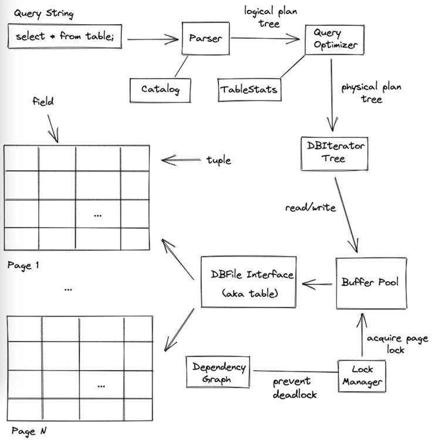

# Tìm hiểu database management system cơ bản (part 2)

## Giới thiệu bài hôm nay
- Thời gian đọc: 30-60 phút đọc.
- Chúng ta sẽ học về cách database xử lý transaction, đảm bảo ACID.
- Two phase locking là gì ?

### Overview của database
- 
- reference of image: https://github.com/awelm/simpledb?tab=readme-ov-file
