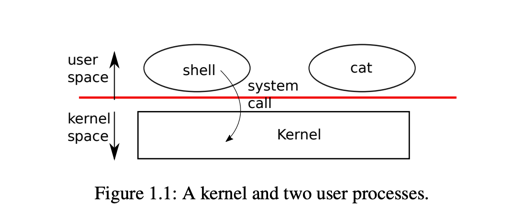
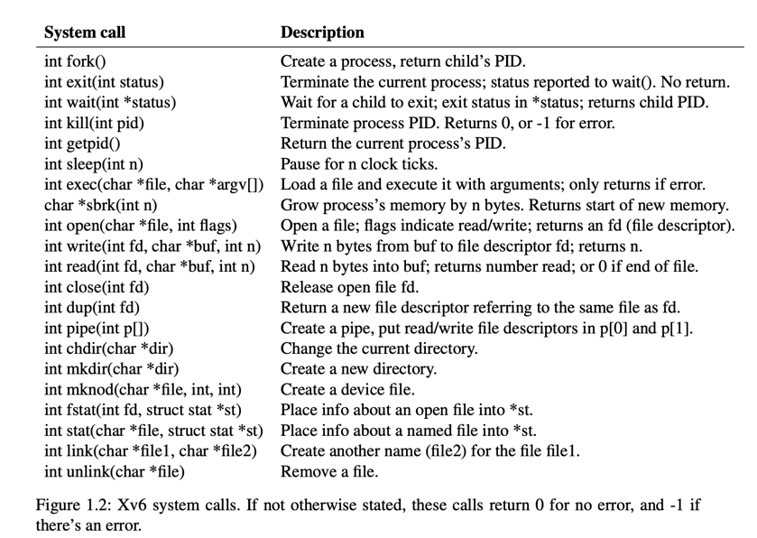

# Operating System Learning by doing part (part 1)
6.S081 MIT Operating System Engineering
ref: https://pdos.csail.mit.edu/6.828/2021/schedule.html
ref: https://pdos.csail.mit.edu/6.828/2021/xv6/book-riscv-rev2.pdf

## Chapter 1: Operating system interfaces



We only have 1 kernel (special program), that provide services 
to run another programs. Each running program (process), 
have it own memory (instruction , data, stack). Process invoke system calls to trigger 
kernel perform services and return.

The shell is a user program too.

Kernel execute `system calls` with privilege, to protect hardware



### 1.1 Processes and memory

An xv6 process consists of user-space memory (instructions, data, and stack) and per-process
state private to the kernel. Xv6 time-shares processes: it transparently switches the available CPUs
among the set of processes waiting to execute. When a process is not executing, xv6 saves its CPU
registers, restoring them when it next runs the process. The kernel associates a process identifier,
or PID, with each process.

A process may create a new process using the fork system call. Fork gives the new process
exactly the same memory contents (both instructions and data) as the calling process

Although the child has the same memory contents as the parent initially, the parent and child are
executing with different memory and different registers: changing a variable in one does not affect
the other. For example, when the return value of wait is stored into pid in the parent process, it
doesn’t change the variable pid in the child. The value of pid in the child will still be zero.

The exec system call replaces the calling process’s memory with a new memory image loaded
from a file stored in the file system. The file must have a particular format, which specifies which
part of the file holds instructions, which part is data, at which instruction to start, etc. Xv6 uses the
ELF format

The xv6 shell uses the above calls to run programs on behalf of users. The main structure of
the shell is simple; see main (user/sh.c:145). The main loop reads a line of input from the user with
getcmd. Then it calls fork, which creates a copy of the shell process. The parent calls wait,
while the child runs the command. For example, if the user had typed “echo hello” to the shell,
runcmd would have been called with “echo hello” as the argument. runcmd (user/sh.c:58) runs
the actual command. For “echo hello”, it would call exec (user/sh.c:78). If exec succeeds then
the child will execute instructions from echo instead of runcmd. At some point echo will call
exit, which will cause the parent to return from wait in main (user/sh.c:145).

You might wonder why fork and exec are not combined in a single call; we will see later that
the shell exploits the separation in its implementation of I/O redirection. To avoid the wastefulness
of creating a duplicate process and then immediately replacing it (with exec), operating kernels
optimize the implementation of fork for this use case by using virtual memory techniques such
as copy-on-write (see Section 4.6).

Xv6 allocates most user-space memory implicitly: fork allocates the memory required for the
child’s copy of the parent’s memory, and exec allocates enough memory to hold the executable
file. A process that needs more memory at run-time (perhaps for malloc) can call sbrk(n) to
grow its data memory by n bytes; sbrk returns the location of the new memory.

### 1.2 I/O and File descriptors

A file descriptor is a small integer representing a kernel-managed object that a process may read
from or write to. A process may obtain a file descriptor by opening a file, directory, or device,
or by creating a pipe, or by duplicating an existing descriptor. For simplicity we’ll often refer
to the object a file descriptor refers to as a “file”; the file descriptor interface abstracts away the
differences between files, pipes, and devices, making them all look like streams of bytes. We’ll
refer to input and output as I/O.

Internally, the xv6 kernel uses the file descriptor as an index into a per-process table, so that
every process has a private space of file descriptors starting at zero. By convention, a process reads
from file descriptor 0 (standard input), writes output to file descriptor 1 (standard output), and
writes error messages to file descriptor 2 (standard error). As we will see, the shell exploits the
convention to implement I/O redirection and pipelines. The shell ensures that it always has three
file descriptors open (user/sh.c:151), which are by default file descriptors for the console.

We can see the cat program, it don't know where input come from, it just read from file descriptor 0 
(that we can redirect to file, console or pipe)

The close system call releases a file descriptor, making it free for reuse by a future open,
pipe, or dup system call (see below). A newly allocated file descriptor is always the 
lowest numbered unused descriptor of the current process.

File descriptors and fork interact to make I/O redirection easy to implement. Fork copies
the parent’s file descriptor table along with its memory, so that the child starts with exactly the
same open files as the parent. The system call exec replaces the calling process’s memory but
preserves its file table. This behavior allows the shell to implement I/O redirection by forking, 
reopening chosen file descriptors in the child, and then calling exec to run the new program.

Although fork copies the file descriptor table, each underlying file offset is shared between
parent and child. Consider this example:

```text
if(fork() == 0) {
    write(1, "hello ", 6);
    exit(0);
} else {
    wait(0);
    write(1, "world\n", 6);
}
```

At the end of this fragment, the file attached to file descriptor 1 will contain the data hello world.
The write in the parent (which, thanks to wait, runs only after the child is done) picks up where
the child’s write left off. This behavior helps produce sequential output from sequences of shell
commands, like (echo hello; echo world) >output.txt

The dup system call duplicates an existing file descriptor, returning a new one that refers to
the same underlying I/O object. Both file descriptors share an offset, just as the file descriptors
duplicated by fork do. This is another way to write hello world into a file:
fd = dup(1);
write(1, "hello ", 6);
write(fd, "world\n", 6);

Two file descriptors share an offset if they were derived from the same original file descriptor
by a sequence of fork and dup calls

**Two file descriptors share an offset if they were derived from the same original file descriptor
by a sequence of fork and dup calls. Otherwise file descriptors do not share offsets, even if they
resulted from open calls for the same file.**

File descriptors are a powerful abstraction, because they hide the details of what they are connected to:
a process writing to file descriptor 1 may be writing to a file, to a device like the console,
or to a pipe.


### 1.3 Pipes

```text
int p[2];
char *argv[2];

argv[0] = "wc";
argv[1] = 0;

pipe(p);
if(fork() == 0) {
    close(0);
    dup(p[0]);
    close(p[0]);
    close(p[1]);
    exec("/bin/wc", argv);
} else {
    close(p[0]);
    write(p[1], "hello world\n", 12);
    close(p[1]);
}
```

###  1.4 File system

the same underlying file, called an inode. Name of file doesn't matter, file can have many names, it's called link 


