# Nand to Tetris

ref: https://www.coursera.org/learn/build-a-computer/lecture/tfRns/unit-0-0-introduction

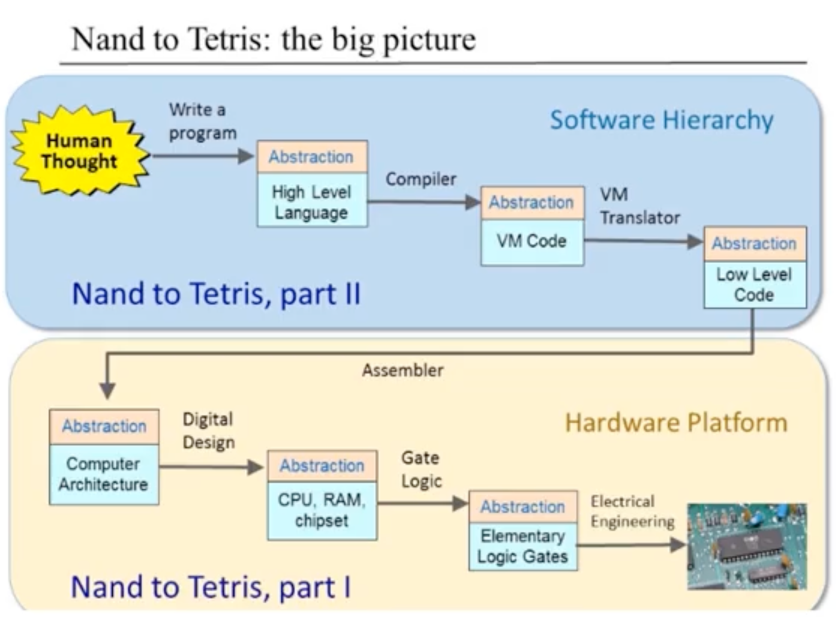

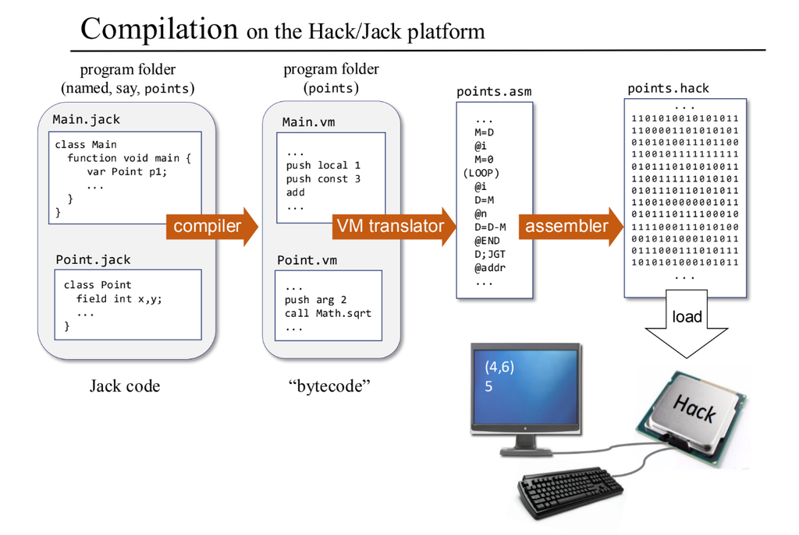

## Part I, building hardware of computer, call heck

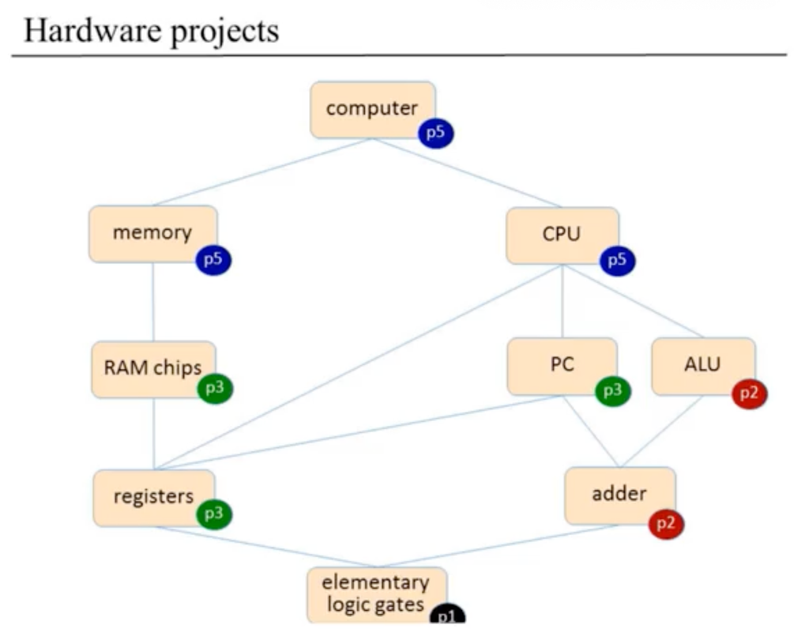

### Hardware description langague (HDL)

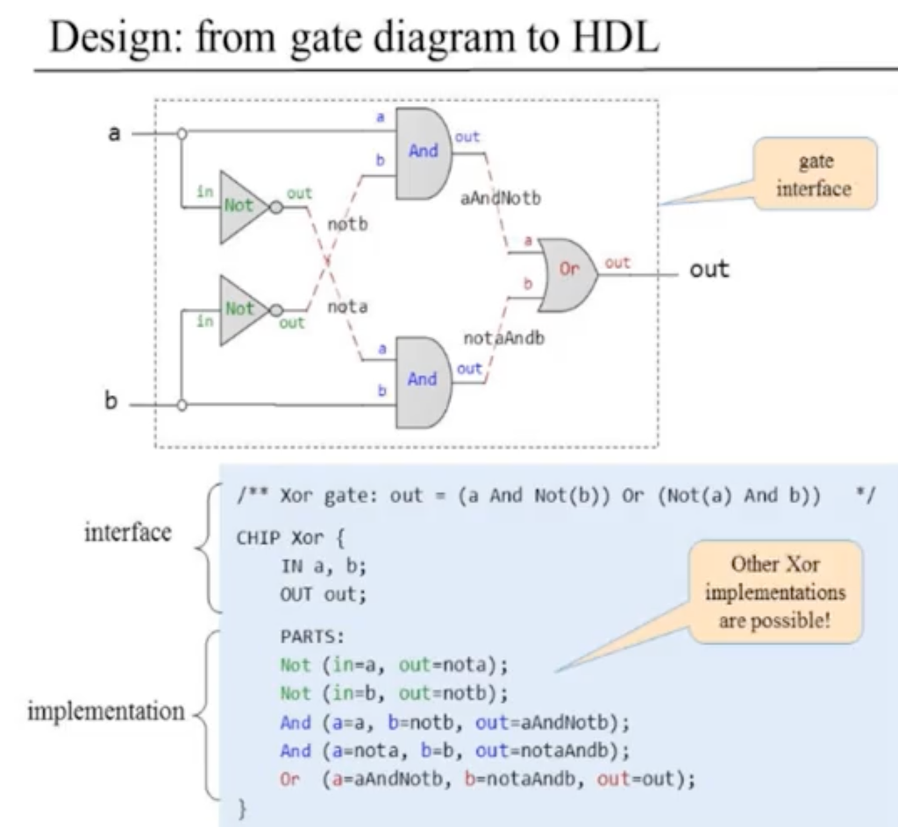

### Register and Memory

### Flip flop

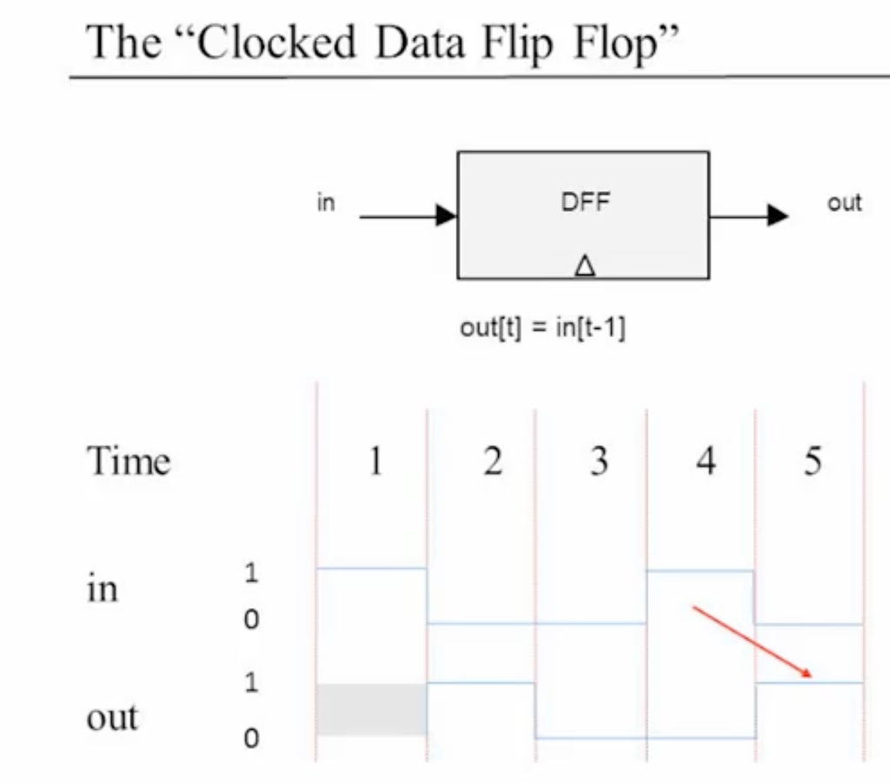

### 1 bit register

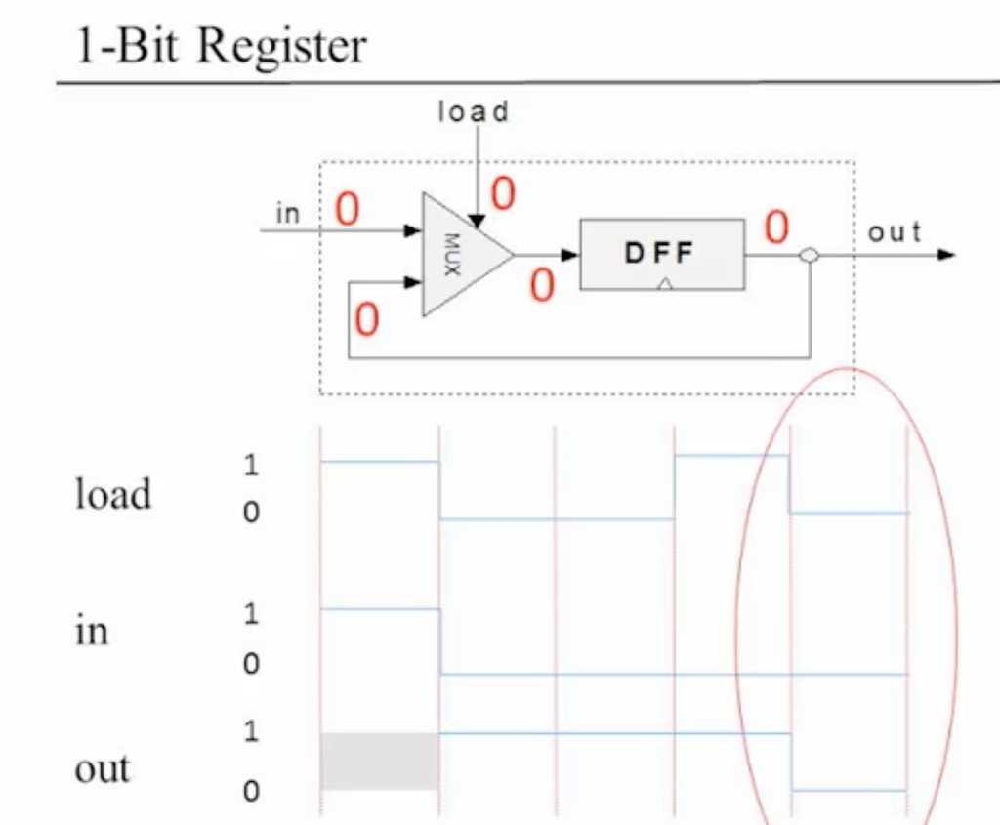

### Memory unit - RAM

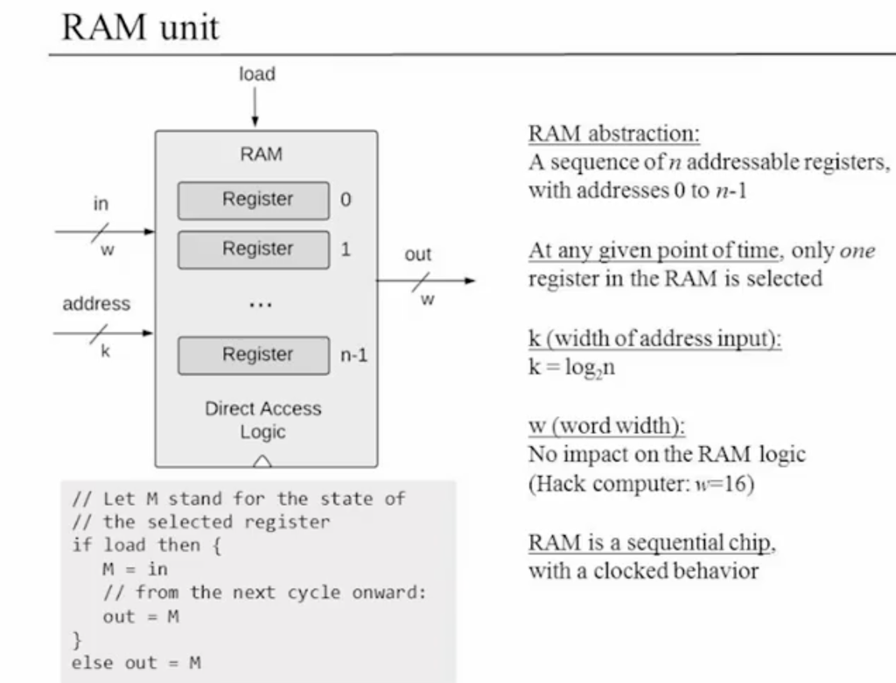

### Program counter

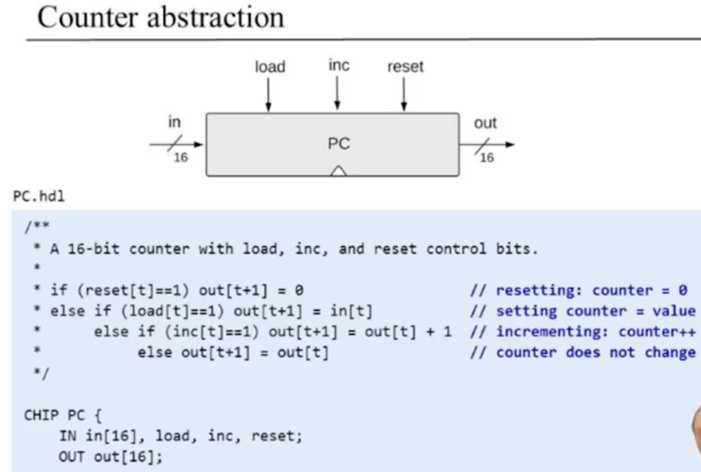

### ALU

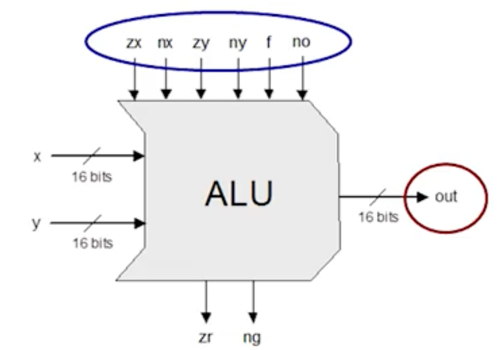

## Machine language

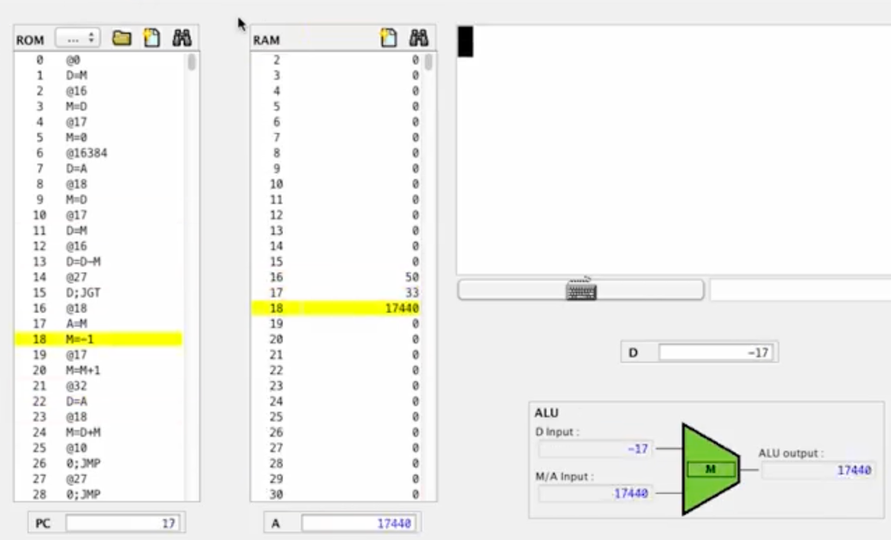

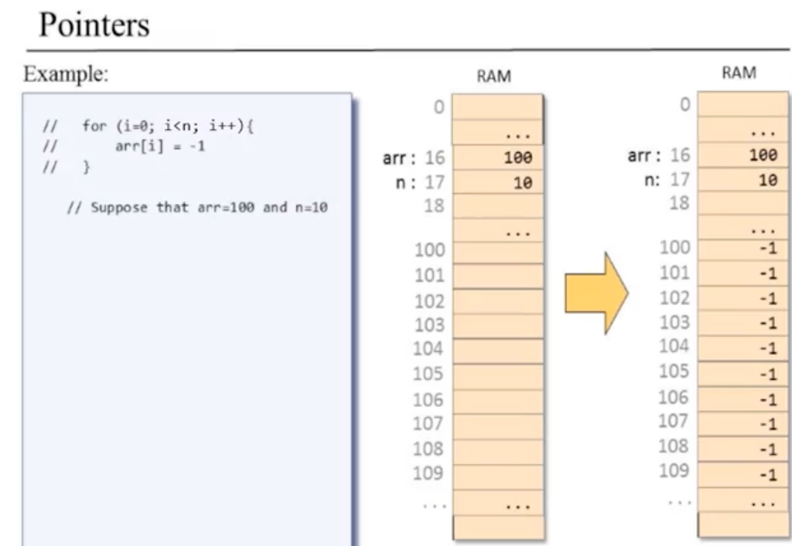

## CPU

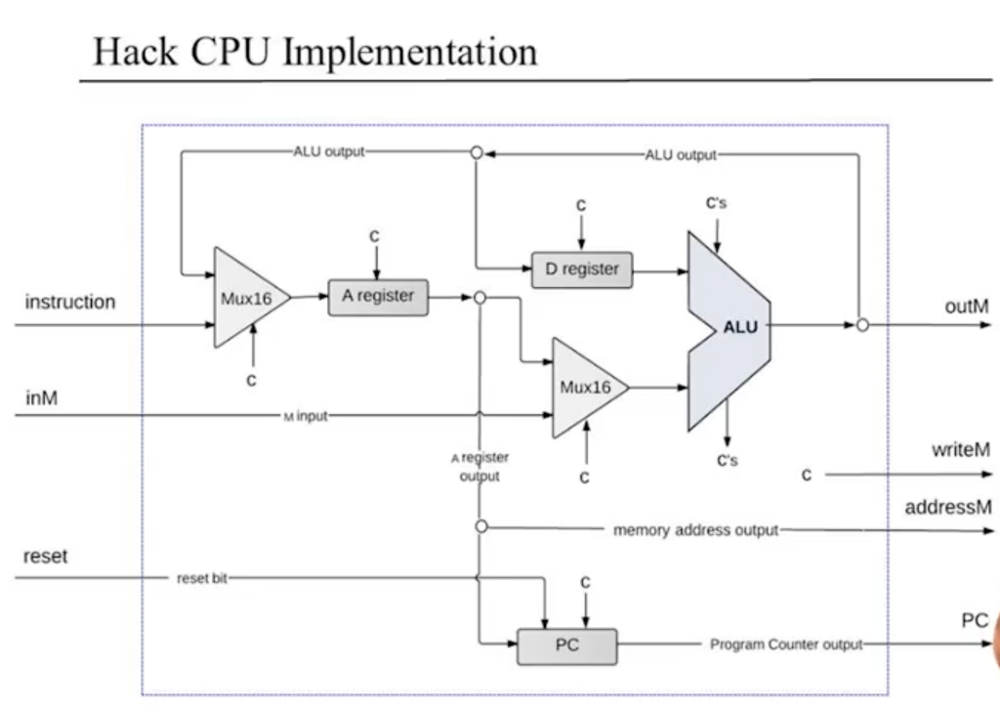

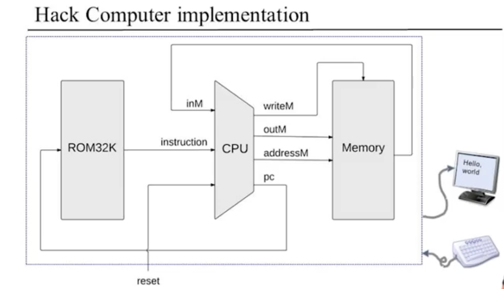

