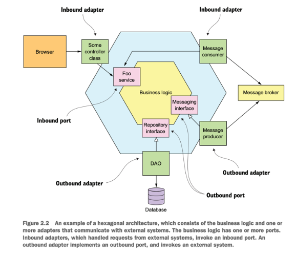

1. Đối với 1 người cũng có kinh nghiệm sơ sơ, thì e cũng chưa thực sự thấy rõ sự khác nhau giữa **Clean Architecture** và **Hexagonal Architecture**, nếu anh giải thích được cho em thì tuyệt !!

2. Em nghĩ nên có hình, ở đây thì e có hình Hexagonal Architecture, để dễ hình dung

ref: book Microservices Patterns With examples in Java

3. Em nghĩ nên nêu ra 1 ví dụ để dễ hiểu 
 
Nên em sẽ nói cái ý tưởng chính mà em thấy ở cả 2 kiến trúc,

- Về layer:
  - inbound (controller)
  - outbound (infrastructure)
  - core  

- Về ý tưởng: tách biệt logic core ra khỏi các hệ thống bên ngoài (nghĩa là core không phụ thuộc vào các layer bên ngoài, database, ...), và sử dụng các `Interfaces` (trong hex thì gọi là port), `Implementation` (trong hex thì gọi là adapter).
  - `Interface` persistant(User user) chỉ là abstraction, layer core sẽ không biết gì, có thể có `Implementation` bằng redis, hoặc database, và thay thế được cho nhau.

- Về tác dụng cơ bản:
  - Dễ thay thế implementation, vì nói chuyện qua interface (ví dụ từ lưu DB mysql qua mongoDB)
  - Dễ test, tương tự như trên, có thể thay thế implementation bằng mock object

- Chú ý:
  - Chúng ta nên nói được, class `User.java` ở core sẽ khác `UserDto.java` ở controller, và cũng khác `UserEntity.java` ở database
    - Tránh core bị ràng buộc với cách lưu trữ dữ liệu (DB) hoặc format API.
    - ví dụ: nếu controller/inbound cần thêm 1 field, thì sẽ ảnh hưởng đến cả core và repository/outbound
  - vấn đề 1, gọi từ controller tới tận repository, không qua layer nào.
  - vấn đề 2: đặt vị trí của class rất lung tung.

