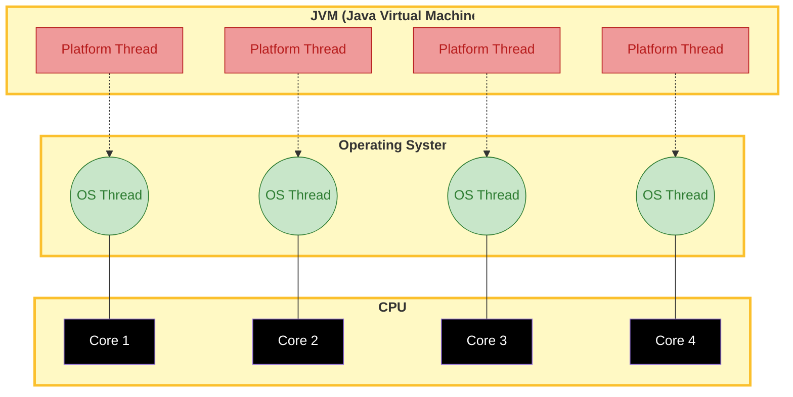

# Ví dụ liquibase - database version control 

## Tóm tắt
- project springboot với database postgresql, sử dụng liquibase để quản lý version của database.

## Prerequisites
- https://docs.liquibase.com/home.html
- Docker, Docker compose


## Code example
- file Dockercompose.yaml
```yaml
version: '3.8'
name: liquibase-self-learn
services:
  postgres:
    image: postgres:15.5-alpine
    restart: always
    ports:
      - "5432:5432"
    environment:
      POSTGRES_USER: postgres
      POSTGRES_PASSWORD: postgres
    volumes:
      - local-postgres-v15:/var/lib/postgresql/data
volumes:
  local-postgres-v15:
    external: true
```

- file build.gradle
```
dependencies {
    implementation 'org.springframework.boot:spring-boot-starter'
    implementation 'org.liquibase:liquibase-core'
    implementation 'org.springframework.boot:spring-boot-starter-data-jpa'
    implementation 'org.postgresql:postgresql'

    compileOnly 'org.projectlombok:lombok'

    annotationProcessor 'org.springframework.boot:spring-boot-configuration-processor'
    annotationProcessor 'org.projectlombok:lombok'
}
```

- file application.yml
```yaml
spring:
  liquibase:
    url: jdbc:postgresql://localhost:5432/${DATABASE_NAME:hoang-test-liquibase}
    user: postgres
    password: postgres
    change-log: "classpath:db/changelog/changelog-master.xml"
  datasource:
    url: jdbc:postgresql://localhost:5432/${DATABASE_NAME:hoang-test-liquibase}
    username: postgres
    password: postgres
```

- file resouces/db/changelog/changelog-master.xml
```xml
<?xml version="1.0" encoding="UTF-8"?>
<databaseChangeLog
        xmlns:xsi="http://www.w3.org/2001/XMLSchema-instance"
        xmlns="http://www.liquibase.org/xml/ns/dbchangelog"
        xsi:schemaLocation="http://www.liquibase.org/xml/ns/dbchangelog https://www.liquibase.org/xml/ns/dbchangelog/dbchangelog-4.7.xsd"
>
    <changeSet author="hoang.tran" id="init_database">
        <sql>
            CREATE TABLE IF NOT EXISTS hoang_s_table
            (
                id                         BIGSERIAL PRIMARY KEY,
                transaction_id             VARCHAR(50) NOT NULL
                );
        </sql>
    </changeSet>

    <changeSet author="huy.loc" id="extend_card_number_length">
        <sql>
            ALTER TABLE hoang_s_table
            ADD name VARCHAR(20);
        </sql>
    </changeSet>
</databaseChangeLog>
```
## Giải thích chi tiết

### **Database Changelog and Database Changelog Lock**
- Khi bạn tạo thay đổi,Liquibase sẽ tạo 2 bảng Database Changelog, Database Changelog Lock
  - The DATABASECHANGELOG table tracks deployed changes so that you have a record. Liquibase compares the changesets in the changelog file with the DATABASECHANGELOG tracking table and deploys only new changesets.
  - DATABASECHANGELOGLOCK prevents multiple instances of Liquibase from updating the database at the same time. The table manages access to the DATABASECHANGELOG table during deployment and ensures only one instance of Liquibase is updating the database.

## Câu hỏi tự trả lời
1. Thêm 1 changSet mới và chạy thử.
2. Thay đổi changeSet cũ và chạy thử, có gì xảy ra ?
  
## References
- https://docs.liquibase.com/home.html