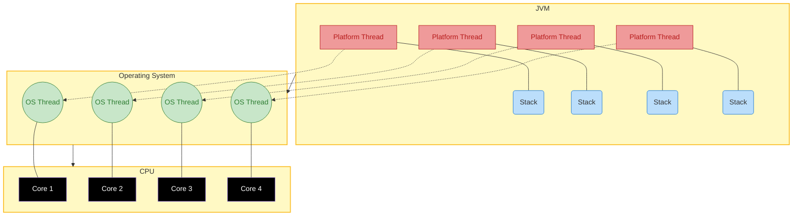
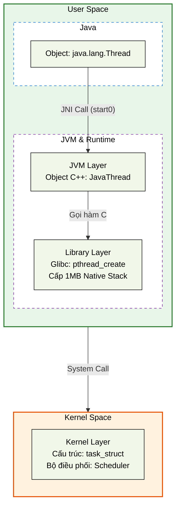
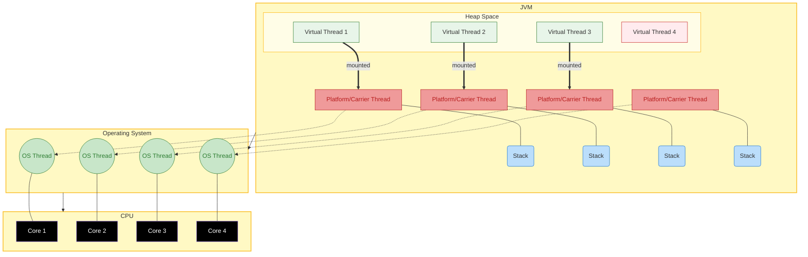
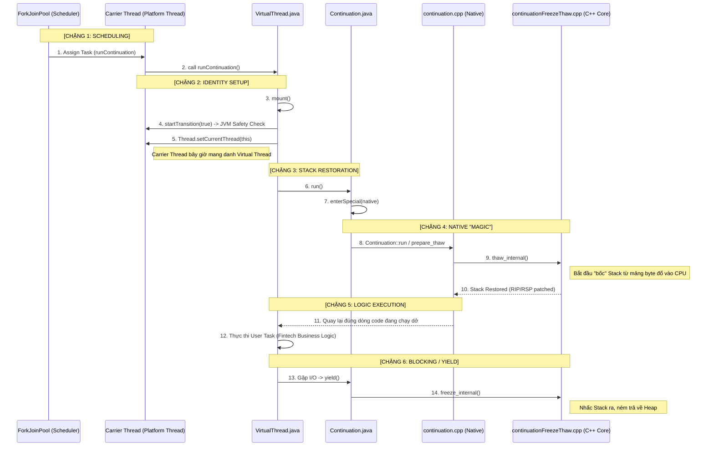
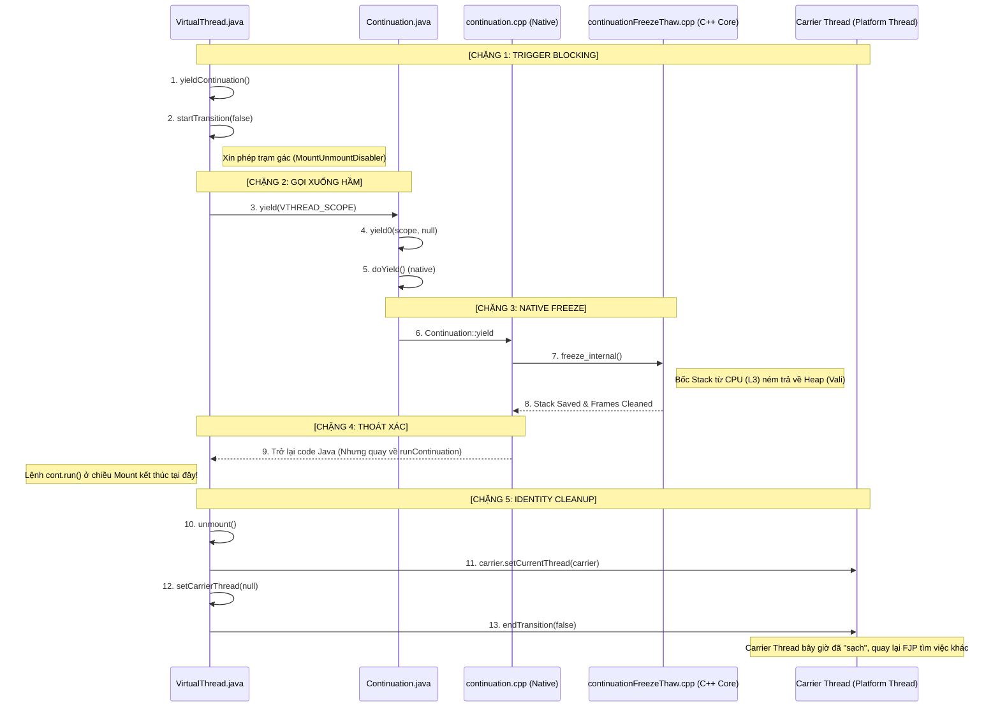
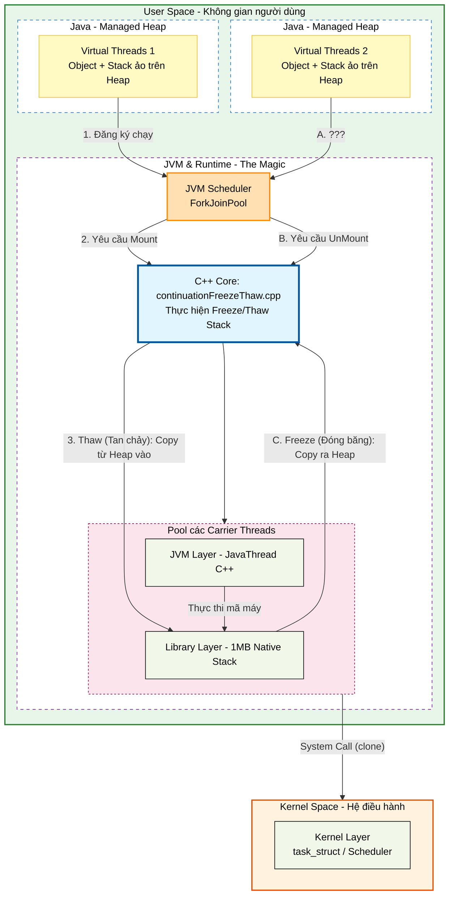

# Virtual Thread


| Characteristic               | Platform Threads                                      | Virtual Threads (JEP 444)                                              |
|------------------------------|-------------------------------------------------------|------------------------------------------------------------------------|
| Managed by                    | Operating system                                      | Java Virtual Machine (JVM)                                             |
| Mapping Model               | 1:1 with OS Thread                                    | M:N (Millions of Virtual Threads multiplexed onto a few Carrier Threads) |
| Memory Overhead    | ~ 1 MB fixed allocation off-heap for the Native Stack | ~2 KB residing entirely on the Java Heap                               |
| Blocking Behavior | Locks the OS thread; forces the CPU into an expensive Kernel Context Switch| Releases the Carrier Thread on the Heap in User-mode|
| Scheduler |  OS Scheduler (Kernel space)|JVM Scheduler|

## Prerequisite

### OpenJDK Layered Architecture

```plaintext
+--------------------------------------------------------------------------+
|                         Java Application Code                            |
|                 (Your Spring Boot, Fintech Logic, etc.)                  |
+--------------------------------------------------------------------------+
                                     |
                                     v
+--------------------------------------------------------------------------+
|                          JDK Base Libraries                              |
|   - java.base (String, Collections)       - java.concurrent (Locks, FJP) |
|   - java.net (Sockets, NIO)               - java.sql / java.logging      |
+--------------------------------------------------------------------------+
                   |                                   |
         (Safe Java Boundary)                (Modern Memory/Native Link)
                   |                                   |
                   v                                   v
+------------------------------------+   +---------------------------------+
|    Java Native Interface (JNI)     |   |   Project Panama (Java 22+)     |
|   - Legacy C/C++ Header Bridge     |   |   - Foreign Function & Memory API  |
|   - `native` keyword / `start0()`  |   |   - Downcall/Upcall Linkers     |
+------------------------------------+   +---------------------------------+
                   |                                   |
                   +-----------------+-----------------+
                                     |
                                     v
+--------------------------------------------------------------------------+
|                             HotSpot JVM                                  |
|   +-------------------+  +---------------------+  +------------------+   |
|   |   Class Loader    |  |  Execution Engine   |  | Memory Manager   |   |
|   |   (Loading,       |  |  (Interpreter,      |  | (CollectedHeap,  |   |
|   |    Verification)  |  |   C1/C2 JIT, GC)    |  |  Metaspace, TLAB)|   |
|   +-------------------+  +---------------------+  +------------------+   |
+--------------------------------------------------------------------------+
                                     |
          System Calls (mmap, clone, pthread_create, futex, epoll)
                                     v
+--------------------------------------------------------------------------+
|                     Operating System Kernel (Linux)                      |
|         [Virtual Memory]       [Scheduler]       [I/O Driver]            |
+--------------------------------------------------------------------------+
```

### Component Diagram

```txt
[ .class files ]
              |
              v
+--------------------------------------------------------------------------+
|                        CLASS LOADER SUBSYSTEM                            |
|   1. Loading (Bootstrap -> Extension/Platform -> Application)            |
|   2. Linking (Verification -> Preparation [Static fields] -> Resolution) |
|   3. Initialization (Running <clinit> method)                            |
+--------------------------------------------------------------------------+
              |
              +-----------------------+
                                      |
                                      v
+--------------------------------------------------------------------------+
|                        RUNTIME DATA AREAS (MEMORY)                       |
|                                                                          |
|  [ Shared across Threads ]           [ Per-Thread Allocated (Private) ]  |
|  +-----------------------------+     +--------------------------------+  |
|  |       Java Heap Object      |     |  Java Thread Stack             |  |
|  |  (Young / Old Gen / Regions) |     |  - Stack Frames (Local Vars)   |  |
|  +-----------------------------+     +--------------------------------+  |
|  |          Metaspace          |     |  PC Registers (Instruction Ptr)|  |
|  |  (Klass metadata, C++ VTables)|     +--------------------------------+  |
|  +-----------------------------+     |  Native Method Stack (C/C++)   |  |
|  +-----------------------------+     +--------------------------------+  |
|  | Code Cache (JIT Compiled)   |                                         |
|  +-----------------------------+                                         |
+--------------------------------------------------------------------------+
              |                                       ^
              | (Read Bytecode / Write Objects)       | (Execute Instructions)
              v                                       |
+--------------------------------------------------------------------------+
|                         EXECUTION ENGINE                                 |
|                                                                          |
|  +---------------------------+       +--------------------------------+  |
|  |        Interpreter        | ----> |      JIT Compiler Pipeline     |  |
|  | (Template Interpreter,    |       |  - C1 Compiler (Client/Fast)   |  |
|  |  Looping Bytecode)        |       |  - C2 Compiler (Server/Opt)    |  |
|  +---------------------------+       +--------------------------------+  |
|                |                                    |                    |
|                v                                    v                    |
|         [ Native Code ]                      [ Optimized Code ]          |
|                |                                    |                    |
|                +-----------------+------------------+                    |
|                                  |                                       |
|                                  v                                       |
|  +--------------------------------------------------------------------+  |
|  |                   Garbage Collector (CollectedHeap)                |  |
|  |     - ZGC / G1GC / ParallelGC (Thread Allocation Buffers - TLAB)   |  |
|  +--------------------------------------------------------------------+  |
+--------------------------------------------------------------------------+
```

### Runtime Object Representation

```text
JAVA HEAP (Vùng nhớ đối tượng)           METASPACE (Vùng nhớ cấu trúc)
+-------------------------------------+  +----------------------------------+
| Java Instance Object (oopDesc)      |  | InstanceKlass (C++ Object)       |
|                                     |  |                                  |
| +---------------------------------+ |  | +------------------------------+ |
| | Mark Word (64-bit)              | |  | | _layout_helper (Size của Obj) | |
| | - Trạng thái Khóa (Biased/Light)| |  | +------------------------------+ |
| | - Thông tin GC Age (Tuổi đối tượng| |  | | _methods (Mảng con trỏ hàm)  | |
| +---------------------------------+ |  | +------------------------------+ |
| | Compressed Klass Word (32-bit)   |---->| | _constants (Constant Pool)   | |
| | - Con trỏ nén trỏ sang Metaspace | |  | +------------------------------+ |
| +---------------------------------+ |  | | _vtable (Bảng hàm ảo C++)    | |
| | Fields Data (Biến instance)     | |  | +------------------------------+ |
| | - int id = 42                   | |  +----------------------------------+
| | - long amount = 15000           | |
| +---------------------------------+ |
+-------------------------------------+
```

## What is platform thread ? 

Platform threads (a.k.a. OS/native threads) are heavyweight threads backed one-to-one by the operating system. Each Java platform thread maps to an OS thread and consumes a native stack and kernel resources.

Native Stack, size: 1MB .  
- TCB (Thread Control Block): Nằm tro  ng nhân Kernel. Chứa các thanh ghi (Registers) như PC (Program Counter), SP (Stack Pointer) của CPU.
- Stack frame
    - Local Variables: Các biến bạn khai báo trong hàm (int a = 5).
    - Return Address: Địa chỉ để CPU biết sau khi chạy xong hàm này thì quay về đâu.
    - Operand Stack: Nơi thực hiện các phép tính nhị phân.


- Ngoài ra còn rất nhiều attribute, resouce khác (dành cho các task khác), mà các object của java không dùng tới,
  nên chúng ta chuyển nó lên cho JVM quản lý





### Analyze java.lang.Thread in Java
- java in Heap
```java
public class Thread implements Runnable {
  private volatile long eetop;
  // thread id
  private final long tid;
  // thread name
  private volatile String name;
  // interrupt status (read/written by VM)
  volatile boolean interrupted;
  // context ClassLoader
  private volatile ClassLoader contextClassLoader;
}
```

- Ở trên Heap, Platform Thread cực kỳ nhẹ, chỉ tốn vài trăm bytes
  - eetop: holds a native pointer/address that VM sets and reads it directly (native code)

### Analyze [JavaThread](https://github.com/openjdk/jdk21/blob/master/src/hotspot/share/runtime/thread.hpp) in HotSpot of OpenJDK

```cpp
class JavaThread: public Thread {
  friend class VMStructs;
 private:
  JavaThreadState _thread_state; // Trạng thái luồng (RUNNABLE, BLOCKED...)
  OSThread* _osthread;      // Con trỏ trỏ thẳng xuống OS Thread
  // ... hàng trăm thuộc tính khác để quản lý luồng
};
```


```text
sysctl kern.maxproc kern.maxprocperuid
kern.maxproc: 6000
kern.maxprocperuid: 4000
```

## [What is virtual thread](https://docs.oracle.com/en/java/javase/25/core/virtual-threads.html) ? 

Virtual threads (from Project Loom) are lightweight threads managed by the JVM (user-mode).
Virtual threads vẫn được chạy trên OS thread, nhưng khi gặp block IO operation, JVM sẽ cất VT đó và chỉ phục hồi lại khi cần thiết.

Virtual thread hoạt động gần giống với virtual mem. JVM map M:N VTs với OS threads.

VTs thì được sinh ra để hoạt động trên IO bound, không có ý định cho CPU bound. (Virtual threads are suitable for running tasks that spend most of the time blocked, often waiting for I/O operations to complete. However, they aren't intended for long-running CPU-intensive operations.)

Virtual Threads hoạt động dựa trên cơ chế Continuation và một bộ scheduler ForkJoinPool

### Tạo và chạy VTs

#### Creating a Virtual Thread with the Thread Class and the Thread.Builder Interface

```java
Thread.Builder builder = Thread.ofVirtual().name("worker-", 0);
Runnable task = () -> {
  System.out.println("Thread ID: " + Thread.currentThread().threadId());
};

// name "worker-0"
Thread t1 = builder.start(task);   
t1.join();
System.out.println(t1.getName() + " terminated");

// name "worker-1"
Thread t2 = builder.start(task);   
t2.join();  
System.out.println(t2.getName() + " terminated");
```
This example print output similar to the following:
```text
Thread ID: 21
worker-0 terminated
Thread ID: 24
worker-1 terminated
```

#### Creating and Running a Virtual Thread with the Executors.newVirtualThreadPerTaskExecutor() Method
```java
try (ExecutorService myExecutor = Executors.newVirtualThreadPerTaskExecutor()) {
    Future<?> future = myExecutor.submit(() -> System.out.println("Running thread"));
    future.get();
    System.out.println("Task completed");
// ...
```




### Code before virtual thread and after virtual thread


### Detail Virtual Thread







## CPU bound vs IO Bound

## Code example

- Sequential (Đồng bộ - Một luồng gánh hết)

```java
Json userRequest = buildUserRequest(); // CPU bound - use 100% CPU core

public void handleRequest() {
    log.info("A: Bắt đầu xử lý");
    User user = serviceB.getUser(); // IO bound
    Balance bal = serviceB.getBalance(); // IO bound
    log.info("A: Hoàn thành cho {}", user.name());
}

// Log kết quả:
// [http-1] A: Bắt đầu xử lý
// [http-1] B: Đang lấy User... (Block 100ms)
// [http-1] B: Đang lấy Balance... (Block 100ms)
// [http-1] A: Hoàn thành.
```

- Platform Thread Pool - 3 platform thread

```java
public void handleRequest() throws Exception {
    log.info("A: Bắt đầu xử lý");
    Future<User> fUser = executor.submit(() -> serviceB.getUser());
    Future<Balance> fBal = executor.submit(() -> serviceB.getBalance());

    User u = fUser.get(); // Block http-thread tại đây
    Balance b = fBal.get();
    log.info("A: Hoàn thành");
}

// Log kết quả:
// [http-1] A: Bắt đầu xử lý
// [pool-1-thread-1] B: Đang lấy User...
// [pool-1-thread-2] B: Đang lấy Balance...
// [http-1] A: Hoàn thành (Sau 100ms)
```

- Giai đoạn 3: CompletableFuture (Async Non-blocking)

```java
// Class A (Controller) gọi xuống Class B (Service)
public void handleRequest() {
    log.info("A: Nhận request");

    // Giao việc cho ForkJoinPool (mặc định của CF)
    CompletableFuture<User> userFuture = CompletableFuture.supplyAsync(() -> serviceB.getUser());
    CompletableFuture<Balance> balFuture = CompletableFuture.supplyAsync(() -> serviceB.getBalance());

    // Kết hợp kết quả
    userFuture.thenAcceptBoth(balFuture, (user, bal) -> {
        log.info("A: Xử lý xong cho {}", user.name());
    });

    log.info("A: Luồng chính rảnh tay làm việc khác");
}

// LOG THỰC TẾ:
// [http-nio-1] A: Nhận request
// [ForkJoinPool.commonPool-worker-1] B: Đang lấy User...
// [ForkJoinPool.commonPool-worker-2] B: Đang lấy Balance...
// [http-nio-1] A: Luồng chính rảnh tay làm việc khác
// [ForkJoinPool.commonPool-worker-2] A: Xử lý xong (Thread nào xong sau cùng sẽ chạy callback)
```

- Spring WebFlux (Reactive - Non-blocking Event Loop)

```java
public Mono<String> handleRequest() {
    log.info("A: Bắt đầu");
    return Mono.zip(serviceB.getUserFlux(), serviceB.getBalanceFlux())
        .map(tuple -> {
            log.info("A: Xử lý kết quả");
            return "Done";
        });
}

// Log kết quả:
// [reactor-http-nio-1] A: Bắt đầu
// [reactor-http-nio-1] B: Gọi User API (Non-blocking)
// [reactor-http-nio-1] B: Gọi Balance API (Non-blocking)
// ... 100ms trôi qua, Thread nio-1 đi làm việc cho request khác ...
// [reactor-http-nio-2] A: Xử lý kết quả (Thread khác nhặt callback lên chạy)
```

WebFlux có **Backpressure,** tốt hơn CF

Việc dùng `ThreadLocal` (để lưu TraceID, TransactionID) trong WebFlux → sẽ gặp vấn đề.

- Virtual thread

```java
public void handleRequest() {
    try (var scope = new StructuredTaskScope.ShutdownOnFailure()) {
        log.info("A: Bắt đầu trên Virtual Thread");
        
        var uTask = scope.fork(() -> serviceB.getUser());
        var bTask = scope.fork(() -> serviceB.getBalance());

        scope.join(); 
        log.info("A: Hoàn thành cho {}", uTask.get().name());
    }
}

// Log kết quả (Lưu ý tên Thread):
// [VirtualThread-[#101]] A: Bắt đầu
// [VirtualThread-[#102]] B: Đang lấy User...
// [VirtualThread-[#103]] B: Đang lấy Balance...
// [VirtualThread-[#101]] A: Hoàn thành
```

Dù log ghi là `VirtualThread-[#101]`, nhưng thực tế bên dưới nó chỉ là một mảng byte trên Heap. Nó không chiếm dụng bất cứ Thread OS nào khi đang đợi I/O.

Vì dù nó bị unmount/remount bao nhiêu lần, cái định danh `VirtualThread-[#101]` vẫn giữ nguyên từ đầu đến cuối. Debug cực sướng!

### Analyze java.lang.VirtualThread in Java

```java
final class VirtualThread extends BaseVirtualThread {

  private final Executor scheduler;
  private final Continuation cont;
  private final Runnable runContinuation;
  // virtual thread state, accessed by VM
  private volatile int state;

  /*
   * Virtual thread state transitions:
   *
   *      NEW -> STARTED         // Thread.start, schedule to run
   *  STARTED -> TERMINATED      // failed to start
   *  STARTED -> RUNNING         // first run
   *  RUNNING -> TERMINATED      // done
   *
   *  RUNNING -> PARKING         // Thread parking with LockSupport.park
   *  PARKING -> PARKED          // cont.yield successful, parked indefinitely
   *   PARKED -> UNPARKED        // unparked, may be scheduled to continue
   * UNPARKED -> RUNNING         // continue execution after park
   *
   *  PARKING -> RUNNING         // cont.yield failed, need to park on carrier
   *  RUNNING -> PINNED          // park on carrier
   *   PINNED -> RUNNING         // unparked, continue execution on same carrier
   *
   *       RUNNING -> TIMED_PARKING   // Thread parking with LockSupport.parkNanos
   * TIMED_PARKING -> TIMED_PARKED    // cont.yield successful, timed-parked
   *  TIMED_PARKED -> UNPARKED        // unparked, may be scheduled to continue
   *
   * TIMED_PARKING -> RUNNING         // cont.yield failed, need to park on carrier
   *       RUNNING -> TIMED_PINNED    // park on carrier
   *  TIMED_PINNED -> RUNNING         // unparked, continue execution on same carrier
   *
   *   RUNNING -> BLOCKING       // blocking on monitor enter
   *  BLOCKING -> BLOCKED        // blocked on monitor enter
   *   BLOCKED -> UNBLOCKED      // unblocked, may be scheduled to continue
   * UNBLOCKED -> RUNNING        // continue execution after blocked on monitor enter
   *
   *   RUNNING -> WAITING        // transitional state during wait on monitor
   *   WAITING -> WAIT           // waiting on monitor
   *      WAIT -> BLOCKED        // notified, waiting to be unblocked by monitor owner
   *      WAIT -> UNBLOCKED      // interrupted
   *
   *       RUNNING -> TIMED_WAITING   // transition state during timed-waiting on monitor
   * TIMED_WAITING -> TIMED_WAIT      // timed-waiting on monitor
   *    TIMED_WAIT -> BLOCKED         // notified, waiting to be unblocked by monitor owner
   *    TIMED_WAIT -> UNBLOCKED       // timed-out/interrupted
   *
   *  RUNNING -> YIELDING        // Thread.yield
   * YIELDING -> YIELDED         // cont.yield successful, may be scheduled to continue
   * YIELDING -> RUNNING         // cont.yield failed
   *  YIELDED -> RUNNING         // continue execution after Thread.yield
   */
  private static final int NEW      = 0;
  private static final int STARTED  = 1;
  private static final int RUNNING  = 2;     // runnable-mounted

  // untimed and timed parking
  private static final int PARKING       = 3;
  private static final int PARKED        = 4;     // unmounted
  private static final int PINNED        = 5;     // mounted
  private static final int TIMED_PARKING = 6;
  private static final int TIMED_PARKED  = 7;     // unmounted
  private static final int TIMED_PINNED  = 8;     // mounted
  private static final int UNPARKED      = 9;     // unmounted but runnable

  // Thread.yield
  private static final int YIELDING = 10;
  private static final int YIELDED  = 11;         // unmounted but runnable

  // monitor enter
  private static final int BLOCKING  = 12;
  private static final int BLOCKED   = 13;        // unmounted
  private static final int UNBLOCKED = 14;        // unmounted but runnable

  // monitor wait/timed-wait
  private static final int WAITING       = 15;
  private static final int WAIT          = 16;    // waiting in Object.wait
  private static final int TIMED_WAITING = 17;
  private static final int TIMED_WAIT    = 18;    // waiting in timed-Object.wait

  private static final int TERMINATED = 99;  // final state
}
```

```java
@ChangesCurrentThread
@ReservedStackAccess
private void mount() {
    startTransition(/*is_mount*/true);
    // We assume following volatile accesses provide equivalent
    // of acquire ordering, otherwise we need U.loadFence() here.

    // sets the carrier thread
    Thread carrier = Thread.currentCarrierThread();
    setCarrierThread(carrier);

    // sync up carrier thread interrupted status if needed
    if (interrupted) {
        carrier.setInterrupt();
    } else if (carrier.isInterrupted()) {
        synchronized (interruptLock) {
            // need to recheck interrupted status
            if (!interrupted) {
                carrier.clearInterrupt();
            }
        }
    }

    // set Thread.currentThread() to return this virtual thread
    carrier.setCurrentThread(this);
}
```

[JNINativeMethod in VirtualThread.c](https://github.com/openjdk/jdk/blob/eb9a8ab5c541a1f1b27731e04044f707bca6bc9f/src/java.base/share/native/libjava/VirtualThread.c#L34)
```c
static JNINativeMethod methods[] = {
    { "endFirstTransition",       "()V",  (void *)&JVM_VirtualThreadEndFirstTransition },
    { "startFinalTransition",     "()V",  (void *)&JVM_VirtualThreadStartFinalTransition },
    { "startTransition",          "(Z)V", (void *)&JVM_VirtualThreadStartTransition },
    { "endTransition",            "(Z)V", (void *)&JVM_VirtualThreadEndTransition },
    { "notifyJvmtiDisableSuspend", "(Z)V", (void *)&JVM_VirtualThreadDisableSuspend },
    { "postPinnedEvent",           "(" STR ")V", (void *)&JVM_VirtualThreadPinnedEvent },
    { "takeVirtualThreadListToUnblock", "()" VIRTUAL_THREAD, (void *)&JVM_TakeVirtualThreadListToUnblock},
};
```

[jvm.ccp](https://github.com/openjdk/jdk/blob/eb9a8ab5c541a1f1b27731e04044f707bca6bc9f/src/hotspot/share/prims/jvm.cpp#L3670)
```
JVM_ENTRY(void, JVM_VirtualThreadStartTransition(JNIEnv* env, jobject vthread, jboolean is_mount))
  oop vt = JNIHandles::resolve_external_guard(vthread);
  MountUnmountDisabler::start_transition(thread, vt, is_mount, false /*is_thread_end*/);
JVM_END
```

- mountUnmountDisabler.cpp -> vthread.cpp -> 
```
```

### 

[continuationFreezeThaw](https://github.com/openjdk/jdk/blob/master/src/hotspot/share/runtime/continuationFreezeThaw.cpp)

```cpp
Thread-stack layout on freeze/thaw.
See corresponding stack-chunk layout in instanceStackChunkKlass.hpp

            +----------------------------+
            |      .                     |
            |      .                     |
            |      .                     |
            |   carrier frames           |
            |                            |
            |----------------------------|
            |                            |
            |    Continuation.run        |
            |                            |
            |============================|
            |    enterSpecial frame      |
            |  pc                        |
            |  rbp                       |
            |  -----                     |
        ^   |  int argsize               | = ContinuationEntry
        |   |  oopDesc* cont             |
        |   |  oopDesc* chunk            |
        |   |  ContinuationEntry* parent |
        |   |  ...                       |
        |   |============================| <------ JavaThread::_cont_entry = entry->sp()
        |   |  ? alignment word ?        |
        |   |----------------------------| <--\
        |   |                            |    |
        |   |  ? caller stack args ?     |    |   argsize (might not be 2-word aligned) words
Address |   |                            |    |   Caller is still in the chunk.
        |   |----------------------------|    |
        |   |  pc (? return barrier ?)   |    |  This pc contains the return barrier when the bottom-most frame
        |   |  rbp                       |    |  isn't the last one in the continuation.
        |   |                            |    |
        |   |    frame                   |    |
        |   |                            |    |
            +----------------------------|     \__ Continuation frames to be frozen/thawed
            |                            |     /
            |    frame                   |    |
            |                            |    |
            |----------------------------|    |
            |                            |    |
            |    frame                   |    |
            |                            |    |
            |----------------------------| <--/
            |                            |
            |    doYield/safepoint stub  | When preempting forcefully, we could have a safepoint stub
            |                            | instead of a doYield stub
            |============================| <- the sp passed to freeze
            |                            |
            |  Native freeze/thaw frames |
            |      .                     |
            |      .                     |
            |      .                     |
            +----------------------------+

************************************************/
```


Legend:
 - VThread / Virtual Thread: lightweight, JVM-scheduled logical thread
 - Carrier/Platform Thread: an OS-backed thread that runs virtual threads when they're active
 - Platform Thread: traditional OS-backed thread (one-to-one mapping)

Quick comparison:
 - Model: Platform = one-to-one, Virtual = many-to-few (multiplexed)
 - Memory: Platform = high per-thread stack, Virtual = small/growable
 - Blocking: Platform blocks the OS thread; Virtual parks and frees the carrier
 - Scalability: Virtual threads scale to many more concurrent tasks with simpler code (blocking-style API)

note: synchronized -> ReentrantLock.
