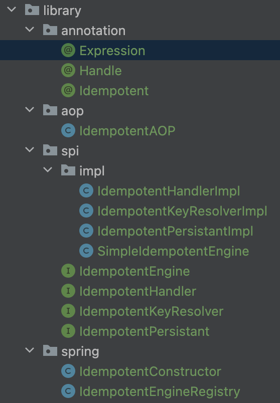

# Viết library với annotation, reflection, aop, springboot

## Tóm tắt
- Hướng dẫn viết 1 thư viện cơ bản dùng annotation, reflection, aop, springboot.
  - Mục đích: check idempotent của 1 api controller dựa trên request param
  - Cách hoạt động: Từ request đầu tiên, chúng ta sẽ lưu key vào redis, từ những field cần thiết, request tiếp theo sẽ được kiềm tra, nếu key đã tồn tại thì trả về lỗi.
  - Cách dùng: đánh annotation trên các method của Controller, ứng với mỗi method sẽ có 1 bean riêng biệt (gọi là IdempotantEngine- được tạo ra từ lúc khởi chạy project), để lấy key, lưu key, handle exception (chúng ta có thể tuỳ biến 3 task này dựa vào annotation).

- Ví dụ:
```
    @Idempotent(id = "id1",
            expression = @Expression(
                    index = 1,
                    clazz = Request.class,
                    field = "name"
            ),
            handle = @Handle(
                    handler = CustomIdempotentHandler.class
            )
    )
    public void idempotent(String params1, Request request) {
    }
```
- Ý nghĩa của Annotation trên:
  - id: vì mỗi method sẽ có 1 IdempotantEngine khác nhau, chúng ta sẽ tạo ra 1 `Map<String,IdempotantEngine>`với key là id để lấy ra engine cần thiết.
  - expression: để xác định key từ request sẽ lấy từ index = 1, clazz = Request.class, field = "name"
    - Trong request có 2 field, index = 1 nghĩa là lấy field thứ 2, clazz = Request.class + field="name" để lấy field bằng reflection. 
  - handle: @Handle(handlerClass = CustomIdempotentHandler.class))
    - là 1 class implement interface IdempotentHandler, chúng ta có thể tuỳ biến logic handle exception ở đây, có thể throw, log, không phụ thuộc vào thư viện
- Các class bổ sung context bên trên
```java
public class Request {
    String name;
    Integer age;
}
``` 
```java
public class CustomIdempotentHandler implements IdempotentHandler {
    public CustomIdempotentHandler() {
    }

    public Object handle(Object[] args) {
        System.out.println("do anything u want");
        throw new RuntimeException("idempotent detected");
    }
}
```
## Prequisites
- Annotation
- Reflection
- Bean trong Springboot
- Aspect Oriented Programming

## Project structure


- spi: logic chính của thư viện
  - chứa class SimpleIdempotentEngine, implementation logic code cơ bản để lưu key, check idempotent, trả lỗi.
- annotation: chứa class annotation Idempotent để đánh dấu trên method của controller, và class annotation con (Handle, Expression) của nó.
  - annotation con giúp chúng ta thay đổi cơ chế:
    - persistant key bằng redis hoặc database.
    - resolve key bằng reflection cơ bản hoặc Spel nâng cao.
    - handler sẽ throw exception hoặc chỉ đơn giản là log.
- spring: class IdempotentConstructor để tạo các bean của spi.
  - Ứng với mỗi method sẽ có 1 bean riêng biệt được tạo ra (Vì cách lấy key, lưu key, handle exception là khác nhau giữa các method)
- aop: logic aop để gọi chính xác spi dựa trên annotation
  - chứa class IdempotentAop để xác định thời điểm check idempotent. 

## Hiện thực
### Tạo spi
```java
public class SimpleIdempotentEngine implements IdempotentEngine {

  private final IdempotentKeyResolver idempotentKeyResolver;
  private final IdempotentPersistant idempotentPersistant;
  private final IdempotentHandler idempotentHandler;

  public SimpleIdempotentEngine(IdempotentKeyResolver idempotentKeyResolver, IdempotentPersistant idempotentPersistant, IdempotentHandler idempotentHandler) {
    this.idempotentKeyResolver = idempotentKeyResolver;
    this.idempotentPersistant = idempotentPersistant;
    this.idempotentHandler = idempotentHandler;
  }

  @Override
  public Object execute(Object[] args) {
    String key = idempotentKeyResolver.resolve(args);
    boolean successfullyPersisted = idempotentPersistant.save(key);
    if (successfullyPersisted) {
      System.out.println("Successfully acquired idempotent key");
      return null;
    }
    System.out.println("Idempotence detected");
    return idempotentHandler.handle(args);
  }
}
```
- Giải thích:
  - Mục đích dùng interface để chúng ta có thể dễ dàng thay đổi implement logic code bên trong.
    - IdempotentKeyResolver để lấy key từ các field của request.
    - idempotentKeyResolver để lấy lưu key vào redis, hoặc database.
    - IdempotentHandler để throw exception hoặc chỉ đơn giản là log. 
    
#### Tạo các interface tương ứng bên trên
```java
public interface IdempotentEngine {
  void execute(Object[] args);
}
public interface IdempotentKeyResolver {
  String resolve(Object[] args);
}
public interface IdempotentHandler {
  Object handle(Object[] args);
}
public interface idempotentPersistant {
  boolean save(String key);
}
```
### Tạo annotation
- Từ mỗi annotation trên method Controller, chúng ta sẽ tạo ra 1 IdempotentEngine tương ứng.
```java
@Target(java.lang.annotation.ElementType.METHOD)
@Retention(java.lang.annotation.RetentionPolicy.RUNTIME)
public @interface Idempotent {
  String id();
  Expression expression();
  Class<? extends IdempotentPersistant> persistent() default IdempotentPersistantImpl.class;
  Handle handle() default @Handle;
}
```
- id: sẽ được dùng làm key để lấy ra IdempotentEngine tương ứng từ IdempotentEngineRegistry
- Expression(index, clazz, field): sẽ được dùng để lấy ra key từ request
- persistent: sẽ được dùng để lưu key vào redis, hoặc database, mặc định sẽ là IdempotentPersistantImpl (xem annotation bên dưới)
- handle: sẽ được dùng để thay đổi logic handle exception, mặc định sẽ là IdempotentHandlerImpl (xem annotation bên dưới)

```java
@Target(ElementType.ANNOTATION_TYPE)
@Retention(RetentionPolicy.RUNTIME)
public @interface Expression {
  int index();
  Class clazz();
  String field();
}
```
        
```java
@Target(ElementType.ANNOTATION_TYPE)
@Retention(java.lang.annotation.RetentionPolicy.RUNTIME)
public @interface Handle {

  IdempotentStrategy strategy() default IdempotentStrategy.THROWING;
  Class<? extends IdempotentHandler> handler() default IdempotentHandlerImpl.class;

  enum IdempotentStrategy {

    THROWING,
    RETURNING,
  }
}

```
- IdempotentHandlerImpl là 1 class implement IdempotentHandler, xem mục 'các implement default'

### Tạo bean spring
- class IdempotentConstructor sẽ được tạo Bean bằng cách dùng @Import trong project chính.
- Đây sẽ là 2 bean được khởi tạo đầu tiên
  - idempotentEngineRegistry() sẽ quét các bean trong project chính, tạo ra 1 `map<String, IdempotentEngine>` được lưu trong IdempotentEngineRegistry.
  - createIdempotentAOP() sẽ được truyền vào IdempotentEngineRegistry, xem mục tạo AOP bên dưới để hiểu rõ hơn
```java
public class IdempotentConstructor {
  @Bean
  public IdempotentEngineRegistry idempotentEngineRegistry(BeanFactory beanFactory){
    return new IdempotentEngineRegistry(beanFactory);
  }

  @Bean
  public IdempotentAOP createIdempotentAOP(IdempotentEngineRegistry idempotentEngineRegistry) {
    return new IdempotentAOP(idempotentEngineRegistry);
  }
}
```

- class IdempotentEngineRegistry sẽ là nơi tạo engine từ các thông tin trên annotation, sau đó bỏ vào `Map<String, IdempotentEngine>`, IdempotentEngine sẽ được lấy ra bằng AOP, mỗi khi method của Controller được gọi. 
```java
import java.lang.annotation.Annotation;
import java.util.HashMap;
import java.util.Iterator;
import java.util.Map;
import java.util.Set;
import org.springframework.beans.factory.BeanFactory;
import org.springframework.beans.factory.annotation.AnnotatedBeanDefinition;
import org.springframework.beans.factory.config.AutowireCapableBeanFactory;
import org.springframework.beans.factory.config.BeanDefinition;
import org.springframework.context.annotation.ClassPathScanningCandidateComponentProvider;
import org.springframework.core.annotation.MergedAnnotation;
import org.springframework.core.type.AnnotationMetadata;
import org.springframework.core.type.MethodMetadata;

public class IdempotentEngineRegistry {
  private final Map<String, IdempotentEngine> idempotentEngines = new HashMap<>();
  private final AutowireCapableBeanFactory beanFactory;

  public IdempotentEngineRegistry(BeanFactory beanFactory){
    this.beanFactory = (AutowireCapableBeanFactory) beanFactory;
    discoverEngines("com.example.idempotentlibrary.using");
  }

  private void discoverEngines(String packageToScan) {
    final ClassPathScanningCandidateComponentProvider scanner =
            new ClassPathScanningCandidateComponentProvider(true);

    createEngineMap(packageToScan, scanner);
  }

  private void createEngineMap(
          String packageToScan, ClassPathScanningCandidateComponentProvider scanner) {
    Set<BeanDefinition> listBean = scanner.findCandidateComponents(packageToScan);

    for (BeanDefinition beanDefinition : listBean) {
      if (beanDefinition instanceof AnnotatedBeanDefinition) {
        AnnotationMetadata annotationMetadata = ((AnnotatedBeanDefinition) beanDefinition).getMetadata();
        Set<MethodMetadata> methodMetadatas = annotationMetadata.getAnnotatedMethods(Idempotent.class.getCanonicalName());
        for (MethodMetadata methodMetadata : methodMetadatas) {
          createEngineEntry(methodMetadata);
        }
      }
    }
  }

  private void createEngineEntry(MethodMetadata methodMetadata) {
    final MergedAnnotation<? extends Annotation> annotationMetadata =
            methodMetadata.getAnnotations().get(Idempotent.class);
    final IdempotentKeyResolver keyExtractor = resolveIdempotentKeyResolve(annotationMetadata);
    final IdempotentPersistant idempotencePersistence = resolveIdempotentPersistant(annotationMetadata);
    final IdempotentHandler idempotenceHandler = resolveIdempotentHandler(annotationMetadata.getAnnotation("handle", Handle.class));

    idempotentEngines.put(annotationMetadata.getString("id"),new SimpleIdempotentEngine(keyExtractor
            ,idempotencePersistence,idempotenceHandler));
  }

  private IdempotentKeyResolver resolveIdempotentKeyResolve(MergedAnnotation<? extends Annotation> idempotent){
    MergedAnnotation mergedAnnotation = idempotent.getAnnotation("expression", Expression.class);
    int index = mergedAnnotation.getInt("index");
    Class clzz = mergedAnnotation.getClass("clazz");
    String field = mergedAnnotation.getString("field");
    return new IdempotentKeyResolverImpl(index, clzz, field);
  }

  private IdempotentPersistant resolveIdempotentPersistant(MergedAnnotation<? extends Annotation> idempotent){
    return createBean(idempotent.getClass("persistent"));
  }
  private IdempotentHandler resolveIdempotentHandler(MergedAnnotation<? extends Annotation> handleAnnotation){

    Handle.IdempotentStrategy strategy = handleAnnotation.getEnum("strategy", Handle.IdempotentStrategy.class);
    if (THROWING.equals(strategy)){
      return new IdempotentHandlerImpl();
    }

    return createBean(handleAnnotation.getClass("handler"));
  }

  @SuppressWarnings("unchecked")
  private <T> T createBean(Class<?> clazz){
    try{
      return (T) beanFactory.getBean(clazz);
    }catch(BeansException e){
      return (T) beanFactory.createBean(clazz);
    }
  }

  public IdempotentEngine get(String name) {
    return idempotentEngines.get(name);
  }

}
```
#### các implement default
```java
public class IdempotentKeyResolverImpl implements IdempotentKeyResolver {
    private int index;
    private Class clzz;
    private String field;

    public IdempotentKeyResolverImpl(int index, Class clzz, String field) {
        this.index = index;
        this.field = field;
        this.clzz = clzz;
    }

    public String resolve(Object[] args) {
        try {
            Field nameField = this.clzz.getDeclaredField(this.field);
            nameField.setAccessible(true);
            return (String)nameField.get(args[this.index]);
        } catch (IllegalAccessException | NoSuchFieldException var3) {
            throw new RuntimeException(var3);
        }
    }
}
```
```java
public class IdempotentPersistantImpl implements IdempotentPersistant {
    private final RedisTemplate<String, String> redisTemplate;

    public IdempotentPersistantImpl(
            RedisTemplate<String, String> redisTemplate) {
        this.redisTemplate = redisTemplate;
    }
    @Override
    public boolean save(String key) {
        final Boolean result = redisTemplate.opsForValue().setIfAbsent(key, key);

        return Optional.ofNullable(result).orElse(false);
    }
}
```
```java
public class IdempotentHandlerImpl implements IdempotentHandler {

    @Override
    public Object handle(Object[] args) {
        System.out.println("You can throw here an exception if you want to.");
        return null;
    }
}
```

### Tạo AOP
- Mục đích: chúng ta sẽ chạy method beforeIdempotentAnnotation mỗi khi method của Controller được gọi (chạy trước).
- IdempotentAop sẽ chứa IdempotentEngineRegistry (chứa `Map<String,IdempotentEngine>`), để lấy đúng engine cần thiết từ id (lấy từ JoinPoint)
- JoinPoint là 1 khái niệm của AOP, có thể lấy ra các data cần thiết từ method của Controller.
```java
@Aspect
public class IdempotentAOP {

  private final IdempotentEngineRegistry idempotentEngineRegistry;
  public IdempotentAOP(IdempotentEngineRegistry idempotentEngineRegistry){
    this.idempotentEngineRegistry = idempotentEngineRegistry;
  }

  @Before("@annotation(com.example.idempotentlibrary.library.annotation.Idempotent)")
  public Object before(JoinPoint joinPoint) {
    MethodSignature signature = (MethodSignature)joinPoint.getSignature();
    Idempotent annotation = signature.getMethod().getDeclaredAnnotation(Idempotent.class);
    String key = annotation.id();
    return idempotentEngineRegistry.get(key).execute(joinPoint.getArgs());
  }
}
```

### build.gradle
```
dependencies {
    implementation 'org.springframework.boot:spring-boot-starter'
    implementation 'org.aspectj:aspectjweaver'
    implementation 'org.aspectj:aspectjrt'
    implementation 'org.springframework.boot:spring-boot-starter-data-redis'

    compileOnly 'org.projectlombok:lombok'
    annotationProcessor 'org.springframework.boot:spring-boot-configuration-processor'
    annotationProcessor 'org.projectlombok:lombok'
}
```

## How to run
- Tạo 1 bean class dùng @Import
```java
@Component
@Import(IdempotentConfiguration.class)
public class IdemController {

  @Idempotent(id = "id1",
          expression = @Expression(
                  index = 1,
                  clazz = Request.class,
                  field = "name"
          ),
          handle = @Handle(
                  handler = CustomIdempotentHandler.class
          )
  )
  public void idempotent(String params1, Request request) {
  }
}
```

```java
@Component
public class Tester {
  @Autowired
  IdemController  idemController;
  @PostConstruct
  public void foo() throws InterruptedException {
    idemController.idempotent("params1", new Request("hoang",23));
  }
}

```

## Giải thích chi tiết

### IdempotentEngineRegistry
- Chúng ta dùng ClassPathScanningCandidateComponentProvider để scan các bean có trong package của project chính.
  - ở đây đang hardcode dùng discoverEngines("com.example.idempotentlibrary.using");
  - bạn có thể config trong file application.yml để tuỳ chỉnh package của các bạn, ví dụ
    - `@Value("${idempotence.spring.package-to-scan:com.finx}") String packageToScan`.
- Bạn có thể debug line by line để hiểu rõ hơn, trong method createEngineMap, chúng ta sẽ lấy ra các method có annotation @Idempotent, sau đó tạo ra 1 IdempotentEngine tương ứng với mỗi method, và bỏ vào `Map<String, IdempotentEngine>`.
  - Hầu hết code chỉ là lấy ra các field từ annotation, chỉ có 1 điểm đáng chú ý là dùng BeanFactory để getBean hoặc createBean, để tạo ra các bean cần thiết.

## Improve thư viện trên
- IdempotentKeyResolver dùng SpEL để có thể lấy field từ request params dễ dàng hơn dùng reflection.
  - https://docs.spring.io/spring-framework/docs/3.0.x/reference/expressions.html